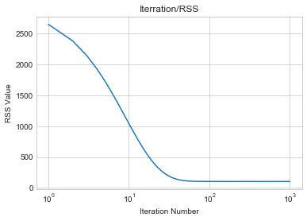
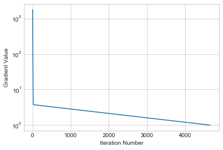

#  First Machine Learning Assignment

Based on the Linear Regression code from Siraj Raval (https://github.com/llSourcell/linear_regression_live), answer the following  questions: 


1. Rode o mesmo programa nos dados contendo anos de escolaridade (primeira coluna) versus salário (segunda coluna). Baixe os dados no link: income.csvVisualizar o documento. Esse exemplo foi trabalhado em sala de aula. 
2. Modifique o código original para imprimir o RSS a cada iteração do gradiente descendente.
3. O que acontece com o RSS ao longo das iterações (aumenta ou diminui) se você usar 1000 iterações? Plote o RSS vs número de iterações.
4. Teste valores diferentes do número de iterações e learning_rate até que w0 e w1 sejam aproximadamente iguais a -39 e 5 respectivamente. Reporte os valores do número de iterações e learning_rate usados para atingir esses valores.
5. O algoritmo do vídeo usa o número de iterações como critério de parada. Mude o algoritmo para considerar um critério de parada que é relacionado ao tamanho do gradiente (como no algoritmo apresentado em sala). Plote o tamanho do gradiente vs número de iterações.
6. Ache um valor de tolerância que se aproxime dos valores dos parâmetros do item 4 acima. Que valor foi esse?
7. Implemente a forma fechada (equações normais) de calcular os coeficientes de regressão (vide algoritmo nos slides). Compare o tempo de processamento com o gradiente descendente considerando sua solução do item 6.


    

### 1. Rode o mesmo programa nos dados contendo anos de escolaridade (primeira coluna) versus salário (segunda coluna). Baixe os dados aquiVisualizar o documento. Esse exemplo foi trabalhado em sala de aula. 

First lets copy the source code from the author github.


```python
#The optimal values of m and b can be actually calculated with way less effort than doing a linear regression. 
#this is just to demonstrate gradient descent

from numpy import *

# y = mx + b
# m is slope, b is y-intercept
def compute_error_for_line_given_points(b, m, points):
    totalError = 0
    for i in range(0, len(points)):
        x = points[i, 0]
        y = points[i, 1]
        totalError += (y - (m * x + b)) ** 2
    return totalError / float(len(points))

def step_gradient(b_current, m_current, points, learningRate):
    b_gradient = 0
    m_gradient = 0
    N = float(len(points))
    for i in range(0, len(points)):
        x = points[i, 0]
        y = points[i, 1]
        b_gradient += -(2/N) * (y - ((m_current * x) + b_current))
        m_gradient += -(2/N) * x * (y - ((m_current * x) + b_current))
    new_b = b_current - (learningRate * b_gradient)
    new_m = m_current - (learningRate * m_gradient)
    return [new_b, new_m]

def gradient_descent_runner(points, starting_b, starting_m, learning_rate, num_iterations):
    b = starting_b
    m = starting_m
    for i in range(num_iterations):
        b, m = step_gradient(b, m, array(points), learning_rate)
    return [b, m]

def run(iterations=1000,lr=0.0001, inputfile="./income.csv", show=True):
    points = genfromtxt(inputfile, delimiter=",")
    learning_rate = lr
    initial_b = 0 # initial y-intercept guess
    initial_m = 0 # initial slope guess
    num_iterations = iterations
    if show:
        print("Starting gradient descent at b = {0}, m = {1}, error = {2}".format(initial_b, initial_m, compute_error_for_line_given_points(initial_b, initial_m, points)))
        print("Running...")
    [b, m] = gradient_descent_runner(points, initial_b, initial_m, learning_rate, num_iterations)
    if show:
        print("After {0} iterations b = {1}, m = {2}, error = {3}".format(num_iterations, b, m, compute_error_for_line_given_points(b, m, points)))
    if not show:
        return [b,m]


```

In order to find the slope (m and b) of the regression equation (*m*x + *b* + error), the algorithm iterate (1000 times) with a learning rate of 1x10^4. As shown in the execution below the algorithm fine b= -0.18 and m = 3 with an error = 103.


```python
run()
```

    Starting gradient descent at b = 0, m = 0, error = 2946.6344970460195
    Running...
    After 1000 iterations b = -0.18234255376510086, m = 3.262182267596014, error = 103.39842291729676
    

#### 2. Modifique o código original para imprimir o RSS a cada iteração do gradiente descendente.

To print the RSS for all iteration of the linear regression algorithm the method gradient_descent_runner() must be changed to print the error (RSS). 


```python
def gradient_descent_runner(points, starting_b, starting_m, learning_rate, num_iterations):
    b = starting_b
    m = starting_m
    
    for i in range(num_iterations):
        b, m = step_gradient(b, m, array(points), learning_rate)
        if i <100 or i > 900:
            print("\t\t Iteration {0},RSS  = {1};".format(i,compute_error_for_line_given_points(b, m, points)))
    return [b, m]

run()
```

    Starting gradient descent at b = 0, m = 0, error = 2946.6344970460195
    Running...
    		 Iteration 0,RSS  = 2648.2381266261386;
    		 Iteration 1,RSS  = 2381.1735926230144;
    		 Iteration 2,RSS  = 2142.151013653971;
    		 Iteration 3,RSS  = 1928.2259499305476;
    		 Iteration 4,RSS  = 1736.7631314659504;
    		 Iteration 5,RSS  = 1565.4039948653665;
    		 Iteration 6,RSS  = 1412.0376287932477;
    		 Iteration 7,RSS  = 1274.7747702022896;
    		 Iteration 8,RSS  = 1151.924530990372;
    		 Iteration 9,RSS  = 1041.9735683871631;
    		 Iteration 10,RSS  = 943.5674424757678;
    		 Iteration 11,RSS  = 855.4939311975465;
    		 Iteration 12,RSS  = 776.6680973019634;
    		 Iteration 13,RSS  = 706.1189232850785;
    		 Iteration 14,RSS  = 642.9773496759485;
    		 Iteration 15,RSS  = 586.4655693176774;
    		 Iteration 16,RSS  = 535.8874457621318;
    		 Iteration 17,RSS  = 490.61993774500473;
    		 Iteration 18,RSS  = 450.105424101551;
    		 Iteration 19,RSS  = 413.8448345756185;
    		 Iteration 20,RSS  = 381.3915019021827;
    		 Iteration 21,RSS  = 352.34565942878487;
    		 Iteration 22,RSS  = 326.34951649348716;
    		 Iteration 23,RSS  = 303.0828508942081;
    		 Iteration 24,RSS  = 282.2590641541991;
    		 Iteration 25,RSS  = 263.6216509895024;
    		 Iteration 26,RSS  = 246.94103948667004;
    		 Iteration 27,RSS  = 232.01176306571264;
    		 Iteration 28,RSS  = 218.6499293904183;
    		 Iteration 29,RSS  = 206.69095504620364;
    		 Iteration 30,RSS  = 195.9875380795778;
    		 Iteration 31,RSS  = 186.40784342345904;
    		 Iteration 32,RSS  = 177.83387885506545;
    		 Iteration 33,RSS  = 170.16004148022643;
    		 Iteration 34,RSS  = 163.29181683863047;
    		 Iteration 35,RSS  = 157.1446146046226;
    		 Iteration 36,RSS  = 151.64272654085167;
    		 Iteration 37,RSS  = 146.7183938680661;
    		 Iteration 38,RSS  = 142.3109725622303;
    		 Iteration 39,RSS  = 138.36618629647026;
    		 Iteration 40,RSS  = 134.83545782503415;
    		 Iteration 41,RSS  = 131.67531057276102;
    		 Iteration 42,RSS  = 128.84683305839033;
    		 Iteration 43,RSS  = 126.31519955408457;
    		 Iteration 44,RSS  = 124.04924107629077;
    		 Iteration 45,RSS  = 122.02106142309056;
    		 Iteration 46,RSS  = 120.20569352810008;
    		 Iteration 47,RSS  = 118.58079189763411;
    		 Iteration 48,RSS  = 117.12635734234605;
    		 Iteration 49,RSS  = 115.82449061238476;
    		 Iteration 50,RSS  = 114.65917190116292;
    		 Iteration 51,RSS  = 113.6160635015014;
    		 Iteration 52,RSS  = 112.68233318312085;
    		 Iteration 53,RSS  = 111.84649611571463;
    		 Iteration 54,RSS  = 111.09827339029314;
    		 Iteration 55,RSS  = 110.42846539596141;
    		 Iteration 56,RSS  = 109.82883849229098;
    		 Iteration 57,RSS  = 109.29202358123185;
    		 Iteration 58,RSS  = 108.81142532909865;
    		 Iteration 59,RSS  = 108.3811409203603;
    		 Iteration 60,RSS  = 107.99588734238121;
    		 Iteration 61,RSS  = 107.65093630535468;
    		 Iteration 62,RSS  = 107.34205599572293;
    		 Iteration 63,RSS  = 107.06545894556012;
    		 Iteration 64,RSS  = 106.81775537573377;
    		 Iteration 65,RSS  = 106.5959114380925;
    		 Iteration 66,RSS  = 106.39721184227459;
    		 Iteration 67,RSS  = 106.21922640674808;
    		 Iteration 68,RSS  = 106.05978012203282;
    		 Iteration 69,RSS  = 105.91692635732085;
    		 Iteration 70,RSS  = 105.78892288043478;
    		 Iteration 71,RSS  = 105.67421039572018;
    		 Iteration 72,RSS  = 105.57139333548542;
    		 Iteration 73,RSS  = 105.47922266836378;
    		 Iteration 74,RSS  = 105.39658051281955;
    		 Iteration 75,RSS  = 105.32246636625382;
    		 Iteration 76,RSS  = 105.25598478007198;
    		 Iteration 77,RSS  = 105.1963343288839;
    		 Iteration 78,RSS  = 105.14279773795165;
    		 Iteration 79,RSS  = 105.09473304726758;
    		 Iteration 80,RSS  = 105.05156570341485;
    		 Iteration 81,RSS  = 105.01278148179247;
    		 Iteration 82,RSS  = 104.97792015201534;
    		 Iteration 83,RSS  = 104.94656980845521;
    		 Iteration 84,RSS  = 104.91836179608188;
    		 Iteration 85,RSS  = 104.89296616909662;
    		 Iteration 86,RSS  = 104.87008762641582;
    		 Iteration 87,RSS  = 104.84946187393308;
    		 Iteration 88,RSS  = 104.83085236874828;
    		 Iteration 89,RSS  = 104.81404740525696;
    		 Iteration 90,RSS  = 104.79885750720354;
    		 Iteration 91,RSS  = 104.78511309357246;
    		 Iteration 92,RSS  = 104.77266238956356;
    		 Iteration 93,RSS  = 104.76136955691736;
    		 Iteration 94,RSS  = 104.75111302055868;
    		 Iteration 95,RSS  = 104.74178397094501;
    		 Iteration 96,RSS  = 104.73328502366935;
    		 Iteration 97,RSS  = 104.72552901980747;
    		 Iteration 98,RSS  = 104.7184379522294;
    		 Iteration 99,RSS  = 104.71194200464971;
    		 Iteration 901,RSS  = 103.53569000641228;
    		 Iteration 902,RSS  = 103.53428802926774;
    		 Iteration 903,RSS  = 103.53288607879014;
    		 Iteration 904,RSS  = 103.53148415497897;
    		 Iteration 905,RSS  = 103.53008225783378;
    		 Iteration 906,RSS  = 103.5286803873541;
    		 Iteration 907,RSS  = 103.52727854353931;
    		 Iteration 908,RSS  = 103.5258767263891;
    		 Iteration 909,RSS  = 103.52447493590263;
    		 Iteration 910,RSS  = 103.52307317207975;
    		 Iteration 911,RSS  = 103.52167143491975;
    		 Iteration 912,RSS  = 103.52026972442212;
    		 Iteration 913,RSS  = 103.51886804058641;
    		 Iteration 914,RSS  = 103.5174663834122;
    		 Iteration 915,RSS  = 103.5160647528988;
    		 Iteration 916,RSS  = 103.51466314904582;
    		 Iteration 917,RSS  = 103.51326157185264;
    		 Iteration 918,RSS  = 103.51186002131901;
    		 Iteration 919,RSS  = 103.51045849744405;
    		 Iteration 920,RSS  = 103.50905700022761;
    		 Iteration 921,RSS  = 103.50765552966885;
    		 Iteration 922,RSS  = 103.50625408576757;
    		 Iteration 923,RSS  = 103.50485266852318;
    		 Iteration 924,RSS  = 103.50345127793504;
    		 Iteration 925,RSS  = 103.5020499140027;
    		 Iteration 926,RSS  = 103.50064857672568;
    		 Iteration 927,RSS  = 103.49924726610354;
    		 Iteration 928,RSS  = 103.49784598213569;
    		 Iteration 929,RSS  = 103.49644472482153;
    		 Iteration 930,RSS  = 103.4950434941608;
    		 Iteration 931,RSS  = 103.49364229015282;
    		 Iteration 932,RSS  = 103.49224111279709;
    		 Iteration 933,RSS  = 103.49083996209309;
    		 Iteration 934,RSS  = 103.4894388380404;
    		 Iteration 935,RSS  = 103.48803774063849;
    		 Iteration 936,RSS  = 103.48663666988678;
    		 Iteration 937,RSS  = 103.48523562578488;
    		 Iteration 938,RSS  = 103.4838346083321;
    		 Iteration 939,RSS  = 103.48243361752812;
    		 Iteration 940,RSS  = 103.48103265337231;
    		 Iteration 941,RSS  = 103.47963171586433;
    		 Iteration 942,RSS  = 103.4782308050035;
    		 Iteration 943,RSS  = 103.47682992078943;
    		 Iteration 944,RSS  = 103.47542906322147;
    		 Iteration 945,RSS  = 103.47402823229916;
    		 Iteration 946,RSS  = 103.47262742802202;
    		 Iteration 947,RSS  = 103.47122665038965;
    		 Iteration 948,RSS  = 103.46982589940143;
    		 Iteration 949,RSS  = 103.46842517505686;
    		 Iteration 950,RSS  = 103.4670244773554;
    		 Iteration 951,RSS  = 103.46562380629663;
    		 Iteration 952,RSS  = 103.46422316188004;
    		 Iteration 953,RSS  = 103.46282254410501;
    		 Iteration 954,RSS  = 103.46142195297118;
    		 Iteration 955,RSS  = 103.46002138847783;
    		 Iteration 956,RSS  = 103.45862085062468;
    		 Iteration 957,RSS  = 103.4572203394112;
    		 Iteration 958,RSS  = 103.45581985483676;
    		 Iteration 959,RSS  = 103.45441939690085;
    		 Iteration 960,RSS  = 103.45301896560314;
    		 Iteration 961,RSS  = 103.45161856094296;
    		 Iteration 962,RSS  = 103.45021818291973;
    		 Iteration 963,RSS  = 103.44881783153322;
    		 Iteration 964,RSS  = 103.4474175067828;
    		 Iteration 965,RSS  = 103.44601720866785;
    		 Iteration 966,RSS  = 103.44461693718793;
    		 Iteration 967,RSS  = 103.4432166923426;
    		 Iteration 968,RSS  = 103.44181647413127;
    		 Iteration 969,RSS  = 103.44041628255346;
    		 Iteration 970,RSS  = 103.43901611760869;
    		 Iteration 971,RSS  = 103.4376159792964;
    		 Iteration 972,RSS  = 103.43621586761618;
    		 Iteration 973,RSS  = 103.43481578256738;
    		 Iteration 974,RSS  = 103.43341572414967;
    		 Iteration 975,RSS  = 103.43201569236241;
    		 Iteration 976,RSS  = 103.43061568720505;
    		 Iteration 977,RSS  = 103.42921570867725;
    		 Iteration 978,RSS  = 103.42781575677841;
    		 Iteration 979,RSS  = 103.42641583150801;
    		 Iteration 980,RSS  = 103.42501593286552;
    		 Iteration 981,RSS  = 103.42361606085056;
    		 Iteration 982,RSS  = 103.42221621546247;
    		 Iteration 983,RSS  = 103.42081639670091;
    		 Iteration 984,RSS  = 103.41941660456517;
    		 Iteration 985,RSS  = 103.41801683905493;
    		 Iteration 986,RSS  = 103.41661710016952;
    		 Iteration 987,RSS  = 103.41521738790854;
    		 Iteration 988,RSS  = 103.41381770227154;
    		 Iteration 989,RSS  = 103.41241804325789;
    		 Iteration 990,RSS  = 103.41101841086717;
    		 Iteration 991,RSS  = 103.40961880509879;
    		 Iteration 992,RSS  = 103.40821922595227;
    		 Iteration 993,RSS  = 103.40681967342712;
    		 Iteration 994,RSS  = 103.40542014752286;
    		 Iteration 995,RSS  = 103.40402064823897;
    		 Iteration 996,RSS  = 103.40262117557488;
    		 Iteration 997,RSS  = 103.4012217295302;
    		 Iteration 998,RSS  = 103.39982231010434;
    		 Iteration 999,RSS  = 103.39842291729676;
    After 1000 iterations b = -0.18234255376510086, m = 3.262182267596014, error = 103.39842291729676
    

PS: To reduce the verbosity of the algorithm output, only the first and last 100 values were printed.

#### 3. O que acontece com o RSS ao longo das iterações (aumenta ou diminui) se você usar 1000 iterações? Plote o RSS vs número de iterações.


```python
def gradient_descent_runner(points, starting_b, starting_m, learning_rate, num_iterations):
    b = starting_b
    m = starting_m
    x = []
    y = []
    for i in range(num_iterations):
        b, m = step_gradient(b, m, array(points), learning_rate)
        x.append(i+1)
        y.append(compute_error_for_line_given_points(b, m, points))
    
    
    import matplotlib.pyplot as plt
    plt.style.use('seaborn-whitegrid')
    plt.plot(x, y)
    plt.title("Iterration/RSS")
    plt.xlabel("Iteration Number")
    plt.ylabel("RSS Value")
    plt.xscale('log')
    #plt.yscale('log')
    plt.show()
    

    return [b, m]

a=run(show=False)
```





As illustrated in the figure above the RSS value fades rapidly until iteration number 100, and from that iteration, the RSS value decrease in a slow ratio (almost stabilized in 112).

#### 4. Teste valores diferentes do número de iterações e learning_rate até que w0 e w1 sejam aproximadamente iguais a -39 e 5 respectivamente. Reporte os valores do número de iterações e learning_rate usados para atingir esses valores.

Before answer, this question lets change de gradient_descent_runner method to the original form.


```python
def gradient_descent_runner(points, starting_b, starting_m, learning_rate, num_iterations):
    b = starting_b
    m = starting_m
    
    for i in range(num_iterations):
        b, m = step_gradient(b, m, array(points), learning_rate)

    return [b, m]
```


To find the w0=5 and w1=-39, we executed the algorithm varying the input parameters; number of iterations (_500,5000,10000,15000,30000,50000_) and learning rate (_0.001,0.002,0.003,0.004,0.005_).


```python
import warnings
warnings.filterwarnings('ignore')
#warnings.filterwarnings(action='once')

for llr in [0.001,0.002,0.003,0.004,0.005]:
    for i in [500,5000,10000,15000,30000,50000]:
        ws = run(iterations=i,lr=llr,show=False)
        w0,w1 = ws[0],ws[1]
        if (w0 >= -39.5 and w0 < -38.8) and (w1 >= 5 and w1 <6):
            print("Iteration {0},Learning Rate  = {1};".format(i,llr))
            print("\t [w0={0}, w1={1}]\n".format(w0,w1))
```

    Iteration 50000,Learning Rate  = 0.001;
    	 [w0=-39.10519020198799, w1=5.579179883407752]
    
    Iteration 30000,Learning Rate  = 0.002;
    	 [w0=-39.31453290150513, w1=5.591641626701886]
    
    Iteration 50000,Learning Rate  = 0.002;
    	 [w0=-39.44332337128485, w1=5.599308260297552]
    
    Iteration 15000,Learning Rate  = 0.003;
    	 [w0=-38.897738890893926, w1=5.566830730603052]
    
    Iteration 30000,Learning Rate  = 0.003;
    	 [w0=-39.438666405196905, w1=5.599031040618761]
    
    Iteration 50000,Learning Rate  = 0.003;
    	 [w0=-39.446231462889585, w1=5.599481373050649]
    
    

As shown in the algorithm output the learning rate of *0.003* starts to return values near the target (w0=39 and w1=5) to _15000_ iterations. Thus to a learning rate of 0.002 and 0.001, the algorithm needs to 30k and 50 iterations respectively. This result indicates that there is an optimization problem, find the learning rate to minimize the number of iteration.

#### 5. O algoritmo do vídeo usa o número de iterações como critério de parada. Mude o algoritmo para considerar um critério de parada que é relacionado ao tamanho do gradiente (como no algoritmo apresentado em sala). Plote o tamanho do gradiente vs número de iterações.

First, the method run() must be changed to receive as input gradient modulus threshold (gradient_threshold)


```python
def run(gradient_threshold=0.1,lr=0.0001, inputfile="./income.csv", show=True , plot=True):
    points = genfromtxt(inputfile, delimiter=",")
    learning_rate = lr
    initial_b = 0 # initial y-intercept guess
    initial_m = 0 # initial slope guess
    if show:
        print("Starting gradient descent at b = {0}, m = {1}, error = {2}".format(initial_b, initial_m, compute_error_for_line_given_points(initial_b, initial_m, points)))
        print("Running...")
    [b, m , i] = gradient_descent_runner(points, initial_b, initial_m, learning_rate, gradient_threshold, plot=plot)
    if show:
        num_iterations = i
        print("After {0} iterations b = {1}, m = {2}, error = {3}".format(num_iterations, b, m, compute_error_for_line_given_points(b, m, points)))
    if not show:
        return [b,m,i]
```

Now lets, change the step_gradient method to return gradient (b_gradient, m_gradient).


```python
def step_gradient(b_current, m_current, points, learningRate):
    b_gradient = 0
    m_gradient = 0
    N = float(len(points))
    for i in range(0, len(points)):
        x = points[i, 0]
        y = points[i, 1]
        b_gradient += -(2/N) * (y - ((m_current * x) + b_current))
        m_gradient += -(2/N) * x * (y - ((m_current * x) + b_current))
    new_b = b_current - (learningRate * b_gradient)
    new_m = m_current - (learningRate * m_gradient)
    return [new_b, new_m, b_gradient, m_gradient]
```

The gradient_descent_runner method recives the new stop condition, gradiente_modulus ($|\nabla_{f}|$) >= gradient_threshold.


```python
def gradient_descent_runner(points, starting_b, starting_m, learning_rate, gradient_threshold, plot=False):
    b = starting_b
    m = starting_m
    x = []
    y = []
    i = 0

    gmodulus = 1 + gradient_threshold
    
    while gmodulus >= gradient_threshold:
        b, m , gb , gm = step_gradient(b, m, array(points), learning_rate)
        #new modulus
        gmodulus = math.sqrt(gb**2 + gm**2)
        
        #plot part
        x.append(i+1)
        y.append(gmodulus)
        i+=1

    
    if plot:
        import matplotlib.pyplot as plt
        plt.style.use('seaborn-whitegrid')
        plt.plot(x, y)
        #plt.xscale('log')
        plt.yscale('log')
        plt.xlabel("Iteration Number")
        plt.ylabel("Gradient Value")

        plt.show()
    
    
    return [b, m ,i]
```

The new implementation was tested using a $lr = 0.003$ (the fastest learning rate of the previous question), and $|\nabla_{f}| >= 1$ as stop condition.


```python
run(gradient_threshold=1,lr=0.003)
```

    Starting gradient descent at b = 0, m = 0, error = 2946.6344970460195
    Running...
    





    After 4658 iterations b = -28.954136895105925, m = 4.974908414819624, error = 35.082183085111716
    

As illustrated in the previous plot the gradient value falls at a constant rate until the stop condition was stratified, $|\nabla_{f}| >= 1$.

#### 6. Ache um valor de tolerância que se aproxime dos valores dos parâmetros do item 4 acima. Que valor foi esse?

As shown in the execution below, the algorithm found the same parameters as in question 4 after 15.156 iteration in 1.19s.


```python
import time

gt = 0.1
w0 = 0
w1 = 8

while not ((w0 > -40 and w0 <= -38.89) and (w1 >= 4.89 and w1 < 6)):
    gt = gt-0.01
    start = time.time()
    w0,w1,i = run(gradient_threshold=gt,lr=0.003,plot=False,show=False)

end = time.time()   
coeftime = end - start
print("After {0} iterations b = {1}, m = {2} with modulus threshold = {3} (execution time = {4}s)".format(i, w0, w1,gt,coeftime))
```

    After 15156 iterations b = -38.92162101491756, m = 5.568252384664014 with modulus threshold = 0.05000000000000002 (execution time = 1.9393978118896484s)
    

#### 7. Implemente a forma fechada (equações normais) de calcular os coeficientes de regressão (vide algoritmo nos slides). Compare o tempo de processamento com o gradiente descendente considerando sua solução do item 6.*

The algorithm was implemented as displayed in the presentation.


```python
def nomalEquation(points):
    temp_x = 0
    temp_y = 0
    b = 0
    m = 0
    N = len(points)
    
    for i in range(0, N):
        x_i = points[i, 0]
        y_i = points[i, 1]
        temp_x += x_i
        temp_y += y_i
        
    x = temp_x / float(N)
    y = temp_y / float(N)
    
    for i in range(0, N):
        xi = points[i, 0]
        yi = points[i, 1]
        b = b + (x_i - x) * (y_i - y)
        m = m + (x_i - x)**2
        
    w1 = b/m
    w0 = y - w1*x
    return [w0,w1]
```

The $run()$ method was modified to invoker the $nomalEquation$ method.


```python
def run(inputfile="./income.csv", show=True):
    points = genfromtxt(inputfile, delimiter=",")
    
    if show:
        print("Running...")
        
    [b, m] = nomalEquation(points)
    
    if show:
        print("b = {0}, m = {1}, error = {2}".format(b, m, compute_error_for_line_given_points(b, m, points)))
    if not show:
        return [b,m]

```


```python
start = time.time()
run()
end = time.time()
ntime = end-start
print(ntime)
```

    Running...
    b = -30.161467210721675, m = 5.019183532346513, error = 34.148888021867066
    0.0039920806884765625
    

As expected the normal method was faster than the gradient runner method $(\frac{coeftime}{ntime} \displaystyle \cong 2660)$. This result can be explained by the fact that the linear regression has a well know method to find the global minimum ( or maximum) point, via the normal form method. However, gradient descends method is useful when there is no easy way to find the global (or local) minimum an maximum of a function. 
