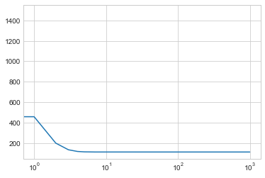

# Hello world


```python
#The optimal values of m and b can be actually calculated with way less effort than doing a linear regression. 
#this is just to demonstrate gradient descent

from numpy import *

# y = mx + b
# m is slope, b is y-intercept
def compute_error_for_line_given_points(b, m, points):
    totalError = 0
    for i in range(0, len(points)):
        x = points[i, 0]
        y = points[i, 1]
        totalError += (y - (m * x + b)) ** 2
    return totalError / float(len(points))

def step_gradient(b_current, m_current, points, learningRate):
    b_gradient = 0
    m_gradient = 0
    N = float(len(points))
    for i in range(0, len(points)):
        x = points[i, 0]
        y = points[i, 1]
        b_gradient += -(2/N) * (y - ((m_current * x) + b_current))
        m_gradient += -(2/N) * x * (y - ((m_current * x) + b_current))
    new_b = b_current - (learningRate * b_gradient)
    new_m = m_current - (learningRate * m_gradient)
    return [new_b, new_m]

def gradient_descent_runner(points, starting_b, starting_m, learning_rate, num_iterations):
    b = starting_b
    m = starting_m
    for i in range(num_iterations):
        b, m = step_gradient(b, m, array(points), learning_rate)
    return [b, m]

def run(iterations=1000):
    points = genfromtxt("./data.csv", delimiter=",")
    learning_rate = 0.0001
    initial_b = 0 # initial y-intercept guess
    initial_m = 0 # initial slope guess
    num_iterations = iterations
    print("Starting gradient descent at b = {0}, m = {1}, error = {2}".format(initial_b, initial_m, compute_error_for_line_given_points(initial_b, initial_m, points)))
    print("Running...")
    [b, m] = gradient_descent_runner(points, initial_b, initial_m, learning_rate, num_iterations)
    print("After {0} iterations b = {1}, m = {2}, error = {3}".format(num_iterations, b, m, compute_error_for_line_given_points(b, m, points)))


```

1. Rode o mesmo programa nos dados contendo anos de escolaridade (primeira coluna) versus salário (segunda coluna). Baixe os dados aquiVisualizar o documento. Esse exemplo foi trabalhado em sala de aula. 


```python
run()
```

    Starting gradient descent at b = 0, m = 0, error = 5565.107834483211
    Running...
    After 1000 iterations b = 0.08893651993741346, m = 1.4777440851894448, error = 112.61481011613473
    

2. Modifique o código original para imprimir o RSS a cada iteração do gradiente descendente.


```python
def gradient_descent_runner(points, starting_b, starting_m, learning_rate, num_iterations):
    b = starting_b
    m = starting_m
    for i in range(num_iterations):
        b, m = step_gradient(b, m, array(points), learning_rate)
        print("\t\t Iteration {0},RSS  = {1};".format(i,compute_error_for_line_given_points(b, m, points)))
    return [b, m]
run()
```

    Starting gradient descent at b = 0, m = 0, error = 5565.107834483211
    Running...
    		 Iteration 0,RSS  = 1484.586557408649;
    		 Iteration 1,RSS  = 457.8542575737673;
    		 Iteration 2,RSS  = 199.50998572553894;
    		 Iteration 3,RSS  = 134.50591058200533;
    		 Iteration 4,RSS  = 118.14969342239947;
    		 Iteration 5,RSS  = 114.0341490603815;
    		 Iteration 6,RSS  = 112.99857731713661;
    		 Iteration 7,RSS  = 112.7379818756847;
    		 Iteration 8,RSS  = 112.67238435909097;
    		 Iteration 9,RSS  = 112.65585181499746;
    		 Iteration 10,RSS  = 112.65166489759584;
    		 Iteration 11,RSS  = 112.65058436150113;
    		 Iteration 12,RSS  = 112.65028544701505;
    		 Iteration 13,RSS  = 112.6501832029397;
    		 Iteration 14,RSS  = 112.65013044507197;
    		 Iteration 15,RSS  = 112.65009013922885;
    		 Iteration 16,RSS  = 112.65005296694635;
    		 Iteration 17,RSS  = 112.65001658353181;
    		 Iteration 18,RSS  = 112.64998039901862;
    		 Iteration 19,RSS  = 112.64994426496074;
    		 Iteration 20,RSS  = 112.64990814400619;
    		 Iteration 21,RSS  = 112.64987202675677;
    		 Iteration 22,RSS  = 112.64983591084761;
    		 Iteration 23,RSS  = 112.6497997956837;
    		 Iteration 24,RSS  = 112.64976368111527;
    		 Iteration 25,RSS  = 112.64972756710466;
    		 Iteration 26,RSS  = 112.64969145364233;
    		 Iteration 27,RSS  = 112.6496553407261;
    		 Iteration 28,RSS  = 112.64961922835515;
    		 Iteration 29,RSS  = 112.64958311652931;
    		 Iteration 30,RSS  = 112.64954700524882;
    		 Iteration 31,RSS  = 112.64951089451318;
    		 Iteration 32,RSS  = 112.64947478432276;
    		 Iteration 33,RSS  = 112.64943867467751;
    		 Iteration 34,RSS  = 112.64940256557722;
    		 Iteration 35,RSS  = 112.64936645702217;
    		 Iteration 36,RSS  = 112.64933034901209;
    		 Iteration 37,RSS  = 112.64929424154703;
    		 Iteration 38,RSS  = 112.64925813462713;
    		 Iteration 39,RSS  = 112.64922202825228;
    		 Iteration 40,RSS  = 112.6491859224223;
    		 Iteration 41,RSS  = 112.64914981713753;
    		 Iteration 42,RSS  = 112.64911371239778;
    		 Iteration 43,RSS  = 112.64907760820297;
    		 Iteration 44,RSS  = 112.64904150455321;
    		 Iteration 45,RSS  = 112.64900540144839;
    		 Iteration 46,RSS  = 112.64896929888867;
    		 Iteration 47,RSS  = 112.64893319687393;
    		 Iteration 48,RSS  = 112.64889709540407;
    		 Iteration 49,RSS  = 112.64886099447925;
    		 Iteration 50,RSS  = 112.64882489409928;
    		 Iteration 51,RSS  = 112.64878879426435;
    		 Iteration 52,RSS  = 112.6487526949743;
    		 Iteration 53,RSS  = 112.64871659622933;
    		 Iteration 54,RSS  = 112.6486804980292;
    		 Iteration 55,RSS  = 112.64864440037395;
    		 Iteration 56,RSS  = 112.64860830326369;
    		 Iteration 57,RSS  = 112.64857220669826;
    		 Iteration 58,RSS  = 112.64853611067775;
    		 Iteration 59,RSS  = 112.64850001520203;
    		 Iteration 60,RSS  = 112.64846392027134;
    		 Iteration 61,RSS  = 112.64842782588546;
    		 Iteration 62,RSS  = 112.64839173204442;
    		 Iteration 63,RSS  = 112.64835563874827;
    		 Iteration 64,RSS  = 112.64831954599687;
    		 Iteration 65,RSS  = 112.64828345379041;
    		 Iteration 66,RSS  = 112.6482473621288;
    		 Iteration 67,RSS  = 112.64821127101195;
    		 Iteration 68,RSS  = 112.64817518043988;
    		 Iteration 69,RSS  = 112.64813909041263;
    		 Iteration 70,RSS  = 112.64810300093023;
    		 Iteration 71,RSS  = 112.64806691199259;
    		 Iteration 72,RSS  = 112.64803082359973;
    		 Iteration 73,RSS  = 112.6479947357516;
    		 Iteration 74,RSS  = 112.64795864844824;
    		 Iteration 75,RSS  = 112.64792256168965;
    		 Iteration 76,RSS  = 112.64788647547576;
    		 Iteration 77,RSS  = 112.64785038980665;
    		 Iteration 78,RSS  = 112.64781430468229;
    		 Iteration 79,RSS  = 112.64777822010262;
    		 Iteration 80,RSS  = 112.64774213606768;
    		 Iteration 81,RSS  = 112.64770605257742;
    		 Iteration 82,RSS  = 112.64766996963193;
    		 Iteration 83,RSS  = 112.64763388723102;
    		 Iteration 84,RSS  = 112.6475978053749;
    		 Iteration 85,RSS  = 112.64756172406332;
    		 Iteration 86,RSS  = 112.64752564329652;
    		 Iteration 87,RSS  = 112.6474895630743;
    		 Iteration 88,RSS  = 112.6474534833968;
    		 Iteration 89,RSS  = 112.64741740426382;
    		 Iteration 90,RSS  = 112.64738132567561;
    		 Iteration 91,RSS  = 112.64734524763193;
    		 Iteration 92,RSS  = 112.64730917013289;
    		 Iteration 93,RSS  = 112.64727309317841;
    		 Iteration 94,RSS  = 112.64723701676857;
    		 Iteration 95,RSS  = 112.6472009409034;
    		 Iteration 96,RSS  = 112.64716486558272;
    		 Iteration 97,RSS  = 112.64712879080662;
    		 Iteration 98,RSS  = 112.64709271657507;
    		 Iteration 99,RSS  = 112.64705664288809;
    		 Iteration 100,RSS  = 112.64702056974568;
    		 Iteration 101,RSS  = 112.64698449714773;
    		 Iteration 102,RSS  = 112.64694842509438;
    		 Iteration 103,RSS  = 112.64691235358552;
    		 Iteration 104,RSS  = 112.64687628262124;
    		 Iteration 105,RSS  = 112.64684021220145;
    		 Iteration 106,RSS  = 112.6468041423261;
    		 Iteration 107,RSS  = 112.64676807299533;
    		 Iteration 108,RSS  = 112.64673200420897;
    		 Iteration 109,RSS  = 112.64669593596709;
    		 Iteration 110,RSS  = 112.64665986826967;
    		 Iteration 111,RSS  = 112.64662380111675;
    		 Iteration 112,RSS  = 112.64658773450829;
    		 Iteration 113,RSS  = 112.6465516684441;
    		 Iteration 114,RSS  = 112.64651560292452;
    		 Iteration 115,RSS  = 112.64647953794936;
    		 Iteration 116,RSS  = 112.64644347351859;
    		 Iteration 117,RSS  = 112.64640740963219;
    		 Iteration 118,RSS  = 112.64637134629021;
    		 Iteration 119,RSS  = 112.6463352834926;
    		 Iteration 120,RSS  = 112.64629922123945;
    		 Iteration 121,RSS  = 112.64626315953065;
    		 Iteration 122,RSS  = 112.64622709836617;
    		 Iteration 123,RSS  = 112.64619103774604;
    		 Iteration 124,RSS  = 112.64615497767028;
    		 Iteration 125,RSS  = 112.64611891813887;
    		 Iteration 126,RSS  = 112.64608285915183;
    		 Iteration 127,RSS  = 112.64604680070912;
    		 Iteration 128,RSS  = 112.64601074281069;
    		 Iteration 129,RSS  = 112.64597468545651;
    		 Iteration 130,RSS  = 112.64593862864669;
    		 Iteration 131,RSS  = 112.64590257238123;
    		 Iteration 132,RSS  = 112.64586651665992;
    		 Iteration 133,RSS  = 112.64583046148299;
    		 Iteration 134,RSS  = 112.64579440685031;
    		 Iteration 135,RSS  = 112.64575835276186;
    		 Iteration 136,RSS  = 112.64572229921764;
    		 Iteration 137,RSS  = 112.64568624621779;
    		 Iteration 138,RSS  = 112.645650193762;
    		 Iteration 139,RSS  = 112.64561414185059;
    		 Iteration 140,RSS  = 112.6455780904833;
    		 Iteration 141,RSS  = 112.64554203966023;
    		 Iteration 142,RSS  = 112.64550598938142;
    		 Iteration 143,RSS  = 112.64546993964676;
    		 Iteration 144,RSS  = 112.64543389045627;
    		 Iteration 145,RSS  = 112.64539784181001;
    		 Iteration 146,RSS  = 112.64536179370792;
    		 Iteration 147,RSS  = 112.64532574614992;
    		 Iteration 148,RSS  = 112.6452896991361;
    		 Iteration 149,RSS  = 112.64525365266653;
    		 Iteration 150,RSS  = 112.64521760674101;
    		 Iteration 151,RSS  = 112.64518156135962;
    		 Iteration 152,RSS  = 112.64514551652229;
    		 Iteration 153,RSS  = 112.64510947222911;
    		 Iteration 154,RSS  = 112.64507342848009;
    		 Iteration 155,RSS  = 112.64503738527512;
    		 Iteration 156,RSS  = 112.64500134261426;
    		 Iteration 157,RSS  = 112.64496530049745;
    		 Iteration 158,RSS  = 112.64492925892475;
    		 Iteration 159,RSS  = 112.64489321789611;
    		 Iteration 160,RSS  = 112.64485717741151;
    		 Iteration 161,RSS  = 112.64482113747094;
    		 Iteration 162,RSS  = 112.64478509807446;
    		 Iteration 163,RSS  = 112.644749059222;
    		 Iteration 164,RSS  = 112.64471302091347;
    		 Iteration 165,RSS  = 112.64467698314903;
    		 Iteration 166,RSS  = 112.64464094592863;
    		 Iteration 167,RSS  = 112.64460490925214;
    		 Iteration 168,RSS  = 112.64456887311977;
    		 Iteration 169,RSS  = 112.6445328375312;
    		 Iteration 170,RSS  = 112.64449680248669;
    		 Iteration 171,RSS  = 112.6444607679862;
    		 Iteration 172,RSS  = 112.64442473402961;
    		 Iteration 173,RSS  = 112.64438870061689;
    		 Iteration 174,RSS  = 112.64435266774825;
    		 Iteration 175,RSS  = 112.64431663542345;
    		 Iteration 176,RSS  = 112.64428060364267;
    		 Iteration 177,RSS  = 112.6442445724057;
    		 Iteration 178,RSS  = 112.6442085417127;
    		 Iteration 179,RSS  = 112.64417251156355;
    		 Iteration 180,RSS  = 112.6441364819583;
    		 Iteration 181,RSS  = 112.64410045289705;
    		 Iteration 182,RSS  = 112.64406442437956;
    		 Iteration 183,RSS  = 112.64402839640596;
    		 Iteration 184,RSS  = 112.64399236897627;
    		 Iteration 185,RSS  = 112.64395634209028;
    		 Iteration 186,RSS  = 112.64392031574826;
    		 Iteration 187,RSS  = 112.64388428994998;
    		 Iteration 188,RSS  = 112.6438482646956;
    		 Iteration 189,RSS  = 112.64381223998498;
    		 Iteration 190,RSS  = 112.64377621581824;
    		 Iteration 191,RSS  = 112.64374019219524;
    		 Iteration 192,RSS  = 112.64370416911612;
    		 Iteration 193,RSS  = 112.64366814658071;
    		 Iteration 194,RSS  = 112.64363212458908;
    		 Iteration 195,RSS  = 112.64359610314125;
    		 Iteration 196,RSS  = 112.64356008223712;
    		 Iteration 197,RSS  = 112.6435240618768;
    		 Iteration 198,RSS  = 112.64348804206018;
    		 Iteration 199,RSS  = 112.64345202278727;
    		 Iteration 200,RSS  = 112.64341600405817;
    		 Iteration 201,RSS  = 112.64337998587274;
    		 Iteration 202,RSS  = 112.64334396823098;
    		 Iteration 203,RSS  = 112.64330795113297;
    		 Iteration 204,RSS  = 112.64327193457875;
    		 Iteration 205,RSS  = 112.64323591856807;
    		 Iteration 206,RSS  = 112.64319990310118;
    		 Iteration 207,RSS  = 112.64316388817782;
    		 Iteration 208,RSS  = 112.64312787379822;
    		 Iteration 209,RSS  = 112.64309185996225;
    		 Iteration 210,RSS  = 112.64305584666988;
    		 Iteration 211,RSS  = 112.64301983392119;
    		 Iteration 212,RSS  = 112.64298382171619;
    		 Iteration 213,RSS  = 112.64294781005468;
    		 Iteration 214,RSS  = 112.64291179893682;
    		 Iteration 215,RSS  = 112.64287578836257;
    		 Iteration 216,RSS  = 112.64283977833193;
    		 Iteration 217,RSS  = 112.64280376884493;
    		 Iteration 218,RSS  = 112.64276775990143;
    		 Iteration 219,RSS  = 112.6427317515016;
    		 Iteration 220,RSS  = 112.64269574364528;
    		 Iteration 221,RSS  = 112.64265973633246;
    		 Iteration 222,RSS  = 112.64262372956311;
    		 Iteration 223,RSS  = 112.64258772333754;
    		 Iteration 224,RSS  = 112.64255171765535;
    		 Iteration 225,RSS  = 112.64251571251665;
    		 Iteration 226,RSS  = 112.64247970792154;
    		 Iteration 227,RSS  = 112.6424437038699;
    		 Iteration 228,RSS  = 112.64240770036173;
    		 Iteration 229,RSS  = 112.64237169739714;
    		 Iteration 230,RSS  = 112.642335694976;
    		 Iteration 231,RSS  = 112.64229969309832;
    		 Iteration 232,RSS  = 112.64226369176401;
    		 Iteration 233,RSS  = 112.64222769097329;
    		 Iteration 234,RSS  = 112.64219169072588;
    		 Iteration 235,RSS  = 112.64215569102208;
    		 Iteration 236,RSS  = 112.64211969186155;
    		 Iteration 237,RSS  = 112.64208369324453;
    		 Iteration 238,RSS  = 112.6420476951709;
    		 Iteration 239,RSS  = 112.64201169764074;
    		 Iteration 240,RSS  = 112.64197570065392;
    		 Iteration 241,RSS  = 112.64193970421047;
    		 Iteration 242,RSS  = 112.64190370831044;
    		 Iteration 243,RSS  = 112.64186771295375;
    		 Iteration 244,RSS  = 112.64183171814044;
    		 Iteration 245,RSS  = 112.64179572387053;
    		 Iteration 246,RSS  = 112.64175973014389;
    		 Iteration 247,RSS  = 112.64172373696064;
    		 Iteration 248,RSS  = 112.64168774432073;
    		 Iteration 249,RSS  = 112.64165175222413;
    		 Iteration 250,RSS  = 112.64161576067083;
    		 Iteration 251,RSS  = 112.64157976966094;
    		 Iteration 252,RSS  = 112.64154377919417;
    		 Iteration 253,RSS  = 112.64150778927082;
    		 Iteration 254,RSS  = 112.64147179989075;
    		 Iteration 255,RSS  = 112.6414358110539;
    		 Iteration 256,RSS  = 112.64139982276036;
    		 Iteration 257,RSS  = 112.64136383501001;
    		 Iteration 258,RSS  = 112.64132784780297;
    		 Iteration 259,RSS  = 112.64129186113917;
    		 Iteration 260,RSS  = 112.6412558750186;
    		 Iteration 261,RSS  = 112.6412198894413;
    		 Iteration 262,RSS  = 112.64118390440706;
    		 Iteration 263,RSS  = 112.64114791991621;
    		 Iteration 264,RSS  = 112.64111193596845;
    		 Iteration 265,RSS  = 112.64107595256394;
    		 Iteration 266,RSS  = 112.64103996970258;
    		 Iteration 267,RSS  = 112.64100398738451;
    		 Iteration 268,RSS  = 112.64096800560942;
    		 Iteration 269,RSS  = 112.64093202437762;
    		 Iteration 270,RSS  = 112.64089604368888;
    		 Iteration 271,RSS  = 112.64086006354336;
    		 Iteration 272,RSS  = 112.64082408394097;
    		 Iteration 273,RSS  = 112.64078810488174;
    		 Iteration 274,RSS  = 112.64075212636556;
    		 Iteration 275,RSS  = 112.6407161483925;
    		 Iteration 276,RSS  = 112.64068017096251;
    		 Iteration 277,RSS  = 112.64064419407566;
    		 Iteration 278,RSS  = 112.64060821773191;
    		 Iteration 279,RSS  = 112.64057224193124;
    		 Iteration 280,RSS  = 112.64053626667368;
    		 Iteration 281,RSS  = 112.64050029195907;
    		 Iteration 282,RSS  = 112.64046431778758;
    		 Iteration 283,RSS  = 112.64042834415913;
    		 Iteration 284,RSS  = 112.64039237107367;
    		 Iteration 285,RSS  = 112.64035639853135;
    		 Iteration 286,RSS  = 112.64032042653194;
    		 Iteration 287,RSS  = 112.64028445507563;
    		 Iteration 288,RSS  = 112.64024848416226;
    		 Iteration 289,RSS  = 112.64021251379188;
    		 Iteration 290,RSS  = 112.64017654396457;
    		 Iteration 291,RSS  = 112.64014057468017;
    		 Iteration 292,RSS  = 112.64010460593882;
    		 Iteration 293,RSS  = 112.64006863774037;
    		 Iteration 294,RSS  = 112.64003267008484;
    		 Iteration 295,RSS  = 112.63999670297227;
    		 Iteration 296,RSS  = 112.63996073640263;
    		 Iteration 297,RSS  = 112.63992477037594;
    		 Iteration 298,RSS  = 112.63988880489222;
    		 Iteration 299,RSS  = 112.63985283995136;
    		 Iteration 300,RSS  = 112.63981687555349;
    		 Iteration 301,RSS  = 112.63978091169842;
    		 Iteration 302,RSS  = 112.63974494838631;
    		 Iteration 303,RSS  = 112.63970898561703;
    		 Iteration 304,RSS  = 112.6396730233907;
    		 Iteration 305,RSS  = 112.63963706170709;
    		 Iteration 306,RSS  = 112.6396011005665;
    		 Iteration 307,RSS  = 112.63956513996865;
    		 Iteration 308,RSS  = 112.6395291799137;
    		 Iteration 309,RSS  = 112.6394932204015;
    		 Iteration 310,RSS  = 112.63945726143221;
    		 Iteration 311,RSS  = 112.6394213030057;
    		 Iteration 312,RSS  = 112.63938534512198;
    		 Iteration 313,RSS  = 112.63934938778108;
    		 Iteration 314,RSS  = 112.63931343098295;
    		 Iteration 315,RSS  = 112.63927747472763;
    		 Iteration 316,RSS  = 112.6392415190151;
    		 Iteration 317,RSS  = 112.6392055638453;
    		 Iteration 318,RSS  = 112.63916960921831;
    		 Iteration 319,RSS  = 112.639133655134;
    		 Iteration 320,RSS  = 112.63909770159255;
    		 Iteration 321,RSS  = 112.63906174859375;
    		 Iteration 322,RSS  = 112.63902579613763;
    		 Iteration 323,RSS  = 112.63898984422433;
    		 Iteration 324,RSS  = 112.63895389285366;
    		 Iteration 325,RSS  = 112.63891794202573;
    		 Iteration 326,RSS  = 112.63888199174049;
    		 Iteration 327,RSS  = 112.63884604199795;
    		 Iteration 328,RSS  = 112.63881009279805;
    		 Iteration 329,RSS  = 112.63877414414088;
    		 Iteration 330,RSS  = 112.63873819602628;
    		 Iteration 331,RSS  = 112.63870224845441;
    		 Iteration 332,RSS  = 112.63866630142515;
    		 Iteration 333,RSS  = 112.63863035493853;
    		 Iteration 334,RSS  = 112.63859440899445;
    		 Iteration 335,RSS  = 112.63855846359314;
    		 Iteration 336,RSS  = 112.63852251873446;
    		 Iteration 337,RSS  = 112.63848657441818;
    		 Iteration 338,RSS  = 112.6384506306446;
    		 Iteration 339,RSS  = 112.63841468741363;
    		 Iteration 340,RSS  = 112.63837874472517;
    		 Iteration 341,RSS  = 112.63834280257946;
    		 Iteration 342,RSS  = 112.63830686097613;
    		 Iteration 343,RSS  = 112.63827091991541;
    		 Iteration 344,RSS  = 112.63823497939728;
    		 Iteration 345,RSS  = 112.63819903942164;
    		 Iteration 346,RSS  = 112.6381630999885;
    		 Iteration 347,RSS  = 112.63812716109791;
    		 Iteration 348,RSS  = 112.63809122274986;
    		 Iteration 349,RSS  = 112.63805528494437;
    		 Iteration 350,RSS  = 112.63801934768121;
    		 Iteration 351,RSS  = 112.63798341096066;
    		 Iteration 352,RSS  = 112.63794747478259;
    		 Iteration 353,RSS  = 112.6379115391469;
    		 Iteration 354,RSS  = 112.63787560405378;
    		 Iteration 355,RSS  = 112.63783966950305;
    		 Iteration 356,RSS  = 112.63780373549474;
    		 Iteration 357,RSS  = 112.63776780202903;
    		 Iteration 358,RSS  = 112.63773186910554;
    		 Iteration 359,RSS  = 112.63769593672463;
    		 Iteration 360,RSS  = 112.63766000488606;
    		 Iteration 361,RSS  = 112.6376240735899;
    		 Iteration 362,RSS  = 112.63758814283621;
    		 Iteration 363,RSS  = 112.63755221262478;
    		 Iteration 364,RSS  = 112.63751628295586;
    		 Iteration 365,RSS  = 112.63748035382919;
    		 Iteration 366,RSS  = 112.637444425245;
    		 Iteration 367,RSS  = 112.63740849720321;
    		 Iteration 368,RSS  = 112.6373725697036;
    		 Iteration 369,RSS  = 112.63733664274642;
    		 Iteration 370,RSS  = 112.63730071633161;
    		 Iteration 371,RSS  = 112.637264790459;
    		 Iteration 372,RSS  = 112.63722886512888;
    		 Iteration 373,RSS  = 112.637192940341;
    		 Iteration 374,RSS  = 112.63715701609536;
    		 Iteration 375,RSS  = 112.63712109239196;
    		 Iteration 376,RSS  = 112.63708516923096;
    		 Iteration 377,RSS  = 112.63704924661226;
    		 Iteration 378,RSS  = 112.63701332453574;
    		 Iteration 379,RSS  = 112.63697740300158;
    		 Iteration 380,RSS  = 112.63694148200952;
    		 Iteration 381,RSS  = 112.63690556155979;
    		 Iteration 382,RSS  = 112.63686964165234;
    		 Iteration 383,RSS  = 112.63683372228705;
    		 Iteration 384,RSS  = 112.63679780346398;
    		 Iteration 385,RSS  = 112.63676188518315;
    		 Iteration 386,RSS  = 112.63672596744448;
    		 Iteration 387,RSS  = 112.63669005024799;
    		 Iteration 388,RSS  = 112.63665413359378;
    		 Iteration 389,RSS  = 112.6366182174817;
    		 Iteration 390,RSS  = 112.63658230191177;
    		 Iteration 391,RSS  = 112.63654638688398;
    		 Iteration 392,RSS  = 112.63651047239836;
    		 Iteration 393,RSS  = 112.6364745584549;
    		 Iteration 394,RSS  = 112.6364386450536;
    		 Iteration 395,RSS  = 112.63640273219437;
    		 Iteration 396,RSS  = 112.63636681987735;
    		 Iteration 397,RSS  = 112.6363309081024;
    		 Iteration 398,RSS  = 112.63629499686957;
    		 Iteration 399,RSS  = 112.63625908617881;
    		 Iteration 400,RSS  = 112.63622317603011;
    		 Iteration 401,RSS  = 112.63618726642349;
    		 Iteration 402,RSS  = 112.636151357359;
    		 Iteration 403,RSS  = 112.63611544883658;
    		 Iteration 404,RSS  = 112.63607954085612;
    		 Iteration 405,RSS  = 112.63604363341773;
    		 Iteration 406,RSS  = 112.63600772652146;
    		 Iteration 407,RSS  = 112.63597182016707;
    		 Iteration 408,RSS  = 112.63593591435489;
    		 Iteration 409,RSS  = 112.63590000908457;
    		 Iteration 410,RSS  = 112.63586410435632;
    		 Iteration 411,RSS  = 112.6358282001701;
    		 Iteration 412,RSS  = 112.63579229652579;
    		 Iteration 413,RSS  = 112.63575639342355;
    		 Iteration 414,RSS  = 112.6357204908632;
    		 Iteration 415,RSS  = 112.63568458884491;
    		 Iteration 416,RSS  = 112.63564868736849;
    		 Iteration 417,RSS  = 112.63561278643405;
    		 Iteration 418,RSS  = 112.63557688604158;
    		 Iteration 419,RSS  = 112.63554098619096;
    		 Iteration 420,RSS  = 112.63550508688235;
    		 Iteration 421,RSS  = 112.63546918811556;
    		 Iteration 422,RSS  = 112.63543328989077;
    		 Iteration 423,RSS  = 112.63539739220785;
    		 Iteration 424,RSS  = 112.63536149506677;
    		 Iteration 425,RSS  = 112.63532559846759;
    		 Iteration 426,RSS  = 112.63528970241039;
    		 Iteration 427,RSS  = 112.63525380689492;
    		 Iteration 428,RSS  = 112.63521791192143;
    		 Iteration 429,RSS  = 112.63518201748965;
    		 Iteration 430,RSS  = 112.63514612359984;
    		 Iteration 431,RSS  = 112.63511023025177;
    		 Iteration 432,RSS  = 112.63507433744559;
    		 Iteration 433,RSS  = 112.63503844518124;
    		 Iteration 434,RSS  = 112.6350025534586;
    		 Iteration 435,RSS  = 112.63496666227783;
    		 Iteration 436,RSS  = 112.63493077163886;
    		 Iteration 437,RSS  = 112.63489488154171;
    		 Iteration 438,RSS  = 112.63485899198623;
    		 Iteration 439,RSS  = 112.6348231029726;
    		 Iteration 440,RSS  = 112.63478721450073;
    		 Iteration 441,RSS  = 112.63475132657057;
    		 Iteration 442,RSS  = 112.63471543918219;
    		 Iteration 443,RSS  = 112.63467955233558;
    		 Iteration 444,RSS  = 112.63464366603056;
    		 Iteration 445,RSS  = 112.63460778026733;
    		 Iteration 446,RSS  = 112.63457189504587;
    		 Iteration 447,RSS  = 112.63453601036606;
    		 Iteration 448,RSS  = 112.63450012622799;
    		 Iteration 449,RSS  = 112.63446424263152;
    		 Iteration 450,RSS  = 112.63442835957675;
    		 Iteration 451,RSS  = 112.6343924770637;
    		 Iteration 452,RSS  = 112.6343565950923;
    		 Iteration 453,RSS  = 112.63432071366255;
    		 Iteration 454,RSS  = 112.63428483277437;
    		 Iteration 455,RSS  = 112.63424895242791;
    		 Iteration 456,RSS  = 112.6342130726231;
    		 Iteration 457,RSS  = 112.63417719335992;
    		 Iteration 458,RSS  = 112.63414131463827;
    		 Iteration 459,RSS  = 112.63410543645823;
    		 Iteration 460,RSS  = 112.63406955881985;
    		 Iteration 461,RSS  = 112.63403368172308;
    		 Iteration 462,RSS  = 112.63399780516784;
    		 Iteration 463,RSS  = 112.6339619291541;
    		 Iteration 464,RSS  = 112.633926053682;
    		 Iteration 465,RSS  = 112.6338901787515;
    		 Iteration 466,RSS  = 112.6338543043625;
    		 Iteration 467,RSS  = 112.63381843051498;
    		 Iteration 468,RSS  = 112.63378255720914;
    		 Iteration 469,RSS  = 112.6337466844447;
    		 Iteration 470,RSS  = 112.63371081222179;
    		 Iteration 471,RSS  = 112.63367494054046;
    		 Iteration 472,RSS  = 112.63363906940049;
    		 Iteration 473,RSS  = 112.63360319880212;
    		 Iteration 474,RSS  = 112.63356732874519;
    		 Iteration 475,RSS  = 112.6335314592297;
    		 Iteration 476,RSS  = 112.6334955902558;
    		 Iteration 477,RSS  = 112.63345972182331;
    		 Iteration 478,RSS  = 112.6334238539322;
    		 Iteration 479,RSS  = 112.6333879865826;
    		 Iteration 480,RSS  = 112.63335211977441;
    		 Iteration 481,RSS  = 112.63331625350764;
    		 Iteration 482,RSS  = 112.63328038778222;
    		 Iteration 483,RSS  = 112.6332445225983;
    		 Iteration 484,RSS  = 112.63320865795575;
    		 Iteration 485,RSS  = 112.63317279385461;
    		 Iteration 486,RSS  = 112.63313693029484;
    		 Iteration 487,RSS  = 112.6331010672764;
    		 Iteration 488,RSS  = 112.63306520479948;
    		 Iteration 489,RSS  = 112.63302934286374;
    		 Iteration 490,RSS  = 112.63299348146946;
    		 Iteration 491,RSS  = 112.63295762061645;
    		 Iteration 492,RSS  = 112.6329217603048;
    		 Iteration 493,RSS  = 112.63288590053456;
    		 Iteration 494,RSS  = 112.63285004130556;
    		 Iteration 495,RSS  = 112.63281418261776;
    		 Iteration 496,RSS  = 112.63277832447147;
    		 Iteration 497,RSS  = 112.63274246686646;
    		 Iteration 498,RSS  = 112.6327066098026;
    		 Iteration 499,RSS  = 112.63267075328005;
    		 Iteration 500,RSS  = 112.63263489729884;
    		 Iteration 501,RSS  = 112.63259904185881;
    		 Iteration 502,RSS  = 112.63256318696007;
    		 Iteration 503,RSS  = 112.63252733260256;
    		 Iteration 504,RSS  = 112.63249147878636;
    		 Iteration 505,RSS  = 112.63245562551135;
    		 Iteration 506,RSS  = 112.6324197727775;
    		 Iteration 507,RSS  = 112.63238392058496;
    		 Iteration 508,RSS  = 112.63234806893354;
    		 Iteration 509,RSS  = 112.63231221782338;
    		 Iteration 510,RSS  = 112.63227636725435;
    		 Iteration 511,RSS  = 112.63224051722653;
    		 Iteration 512,RSS  = 112.63220466773986;
    		 Iteration 513,RSS  = 112.6321688187944;
    		 Iteration 514,RSS  = 112.63213297039009;
    		 Iteration 515,RSS  = 112.63209712252687;
    		 Iteration 516,RSS  = 112.63206127520485;
    		 Iteration 517,RSS  = 112.6320254284239;
    		 Iteration 518,RSS  = 112.63198958218415;
    		 Iteration 519,RSS  = 112.63195373648541;
    		 Iteration 520,RSS  = 112.63191789132783;
    		 Iteration 521,RSS  = 112.63188204671144;
    		 Iteration 522,RSS  = 112.63184620263604;
    		 Iteration 523,RSS  = 112.6318103591017;
    		 Iteration 524,RSS  = 112.63177451610842;
    		 Iteration 525,RSS  = 112.63173867365639;
    		 Iteration 526,RSS  = 112.63170283174517;
    		 Iteration 527,RSS  = 112.63166699037512;
    		 Iteration 528,RSS  = 112.63163114954608;
    		 Iteration 529,RSS  = 112.63159530925806;
    		 Iteration 530,RSS  = 112.63155946951116;
    		 Iteration 531,RSS  = 112.63152363030525;
    		 Iteration 532,RSS  = 112.63148779164025;
    		 Iteration 533,RSS  = 112.6314519535163;
    		 Iteration 534,RSS  = 112.63141611593345;
    		 Iteration 535,RSS  = 112.63138027889144;
    		 Iteration 536,RSS  = 112.63134444239046;
    		 Iteration 537,RSS  = 112.63130860643038;
    		 Iteration 538,RSS  = 112.63127277101137;
    		 Iteration 539,RSS  = 112.63123693613325;
    		 Iteration 540,RSS  = 112.63120110179608;
    		 Iteration 541,RSS  = 112.63116526799992;
    		 Iteration 542,RSS  = 112.63112943474458;
    		 Iteration 543,RSS  = 112.63109360203019;
    		 Iteration 544,RSS  = 112.63105776985664;
    		 Iteration 545,RSS  = 112.63102193822411;
    		 Iteration 546,RSS  = 112.6309861071324;
    		 Iteration 547,RSS  = 112.63095027658164;
    		 Iteration 548,RSS  = 112.63091444657174;
    		 Iteration 549,RSS  = 112.63087861710272;
    		 Iteration 550,RSS  = 112.63084278817455;
    		 Iteration 551,RSS  = 112.63080695978715;
    		 Iteration 552,RSS  = 112.6307711319407;
    		 Iteration 553,RSS  = 112.63073530463502;
    		 Iteration 554,RSS  = 112.63069947787024;
    		 Iteration 555,RSS  = 112.63066365164622;
    		 Iteration 556,RSS  = 112.630627825963;
    		 Iteration 557,RSS  = 112.63059200082068;
    		 Iteration 558,RSS  = 112.63055617621909;
    		 Iteration 559,RSS  = 112.63052035215821;
    		 Iteration 560,RSS  = 112.63048452863819;
    		 Iteration 561,RSS  = 112.63044870565898;
    		 Iteration 562,RSS  = 112.63041288322057;
    		 Iteration 563,RSS  = 112.63037706132275;
    		 Iteration 564,RSS  = 112.63034123996574;
    		 Iteration 565,RSS  = 112.6303054191495;
    		 Iteration 566,RSS  = 112.63026959887401;
    		 Iteration 567,RSS  = 112.63023377913917;
    		 Iteration 568,RSS  = 112.63019795994518;
    		 Iteration 569,RSS  = 112.63016214129183;
    		 Iteration 570,RSS  = 112.6301263231791;
    		 Iteration 571,RSS  = 112.63009050560706;
    		 Iteration 572,RSS  = 112.63005468857583;
    		 Iteration 573,RSS  = 112.63001887208512;
    		 Iteration 574,RSS  = 112.62998305613517;
    		 Iteration 575,RSS  = 112.62994724072587;
    		 Iteration 576,RSS  = 112.62991142585724;
    		 Iteration 577,RSS  = 112.6298756115292;
    		 Iteration 578,RSS  = 112.62983979774187;
    		 Iteration 579,RSS  = 112.62980398449507;
    		 Iteration 580,RSS  = 112.62976817178891;
    		 Iteration 581,RSS  = 112.62973235962338;
    		 Iteration 582,RSS  = 112.62969654799844;
    		 Iteration 583,RSS  = 112.62966073691409;
    		 Iteration 584,RSS  = 112.62962492637038;
    		 Iteration 585,RSS  = 112.62958911636711;
    		 Iteration 586,RSS  = 112.62955330690458;
    		 Iteration 587,RSS  = 112.62951749798249;
    		 Iteration 588,RSS  = 112.62948168960094;
    		 Iteration 589,RSS  = 112.62944588176;
    		 Iteration 590,RSS  = 112.62941007445956;
    		 Iteration 591,RSS  = 112.62937426769969;
    		 Iteration 592,RSS  = 112.62933846148024;
    		 Iteration 593,RSS  = 112.62930265580145;
    		 Iteration 594,RSS  = 112.62926685066304;
    		 Iteration 595,RSS  = 112.62923104606514;
    		 Iteration 596,RSS  = 112.62919524200777;
    		 Iteration 597,RSS  = 112.62915943849079;
    		 Iteration 598,RSS  = 112.6291236355144;
    		 Iteration 599,RSS  = 112.62908783307839;
    		 Iteration 600,RSS  = 112.62905203118288;
    		 Iteration 601,RSS  = 112.6290162298278;
    		 Iteration 602,RSS  = 112.62898042901317;
    		 Iteration 603,RSS  = 112.6289446287389;
    		 Iteration 604,RSS  = 112.6289088290051;
    		 Iteration 605,RSS  = 112.62887302981179;
    		 Iteration 606,RSS  = 112.62883723115873;
    		 Iteration 607,RSS  = 112.62880143304614;
    		 Iteration 608,RSS  = 112.62876563547397;
    		 Iteration 609,RSS  = 112.62872983844208;
    		 Iteration 610,RSS  = 112.62869404195065;
    		 Iteration 611,RSS  = 112.62865824599959;
    		 Iteration 612,RSS  = 112.62862245058888;
    		 Iteration 613,RSS  = 112.62858665571854;
    		 Iteration 614,RSS  = 112.62855086138842;
    		 Iteration 615,RSS  = 112.62851506759874;
    		 Iteration 616,RSS  = 112.62847927434923;
    		 Iteration 617,RSS  = 112.62844348164022;
    		 Iteration 618,RSS  = 112.62840768947147;
    		 Iteration 619,RSS  = 112.62837189784304;
    		 Iteration 620,RSS  = 112.62833610675482;
    		 Iteration 621,RSS  = 112.62830031620695;
    		 Iteration 622,RSS  = 112.62826452619935;
    		 Iteration 623,RSS  = 112.62822873673194;
    		 Iteration 624,RSS  = 112.62819294780488;
    		 Iteration 625,RSS  = 112.62815715941797;
    		 Iteration 626,RSS  = 112.6281213715714;
    		 Iteration 627,RSS  = 112.62808558426495;
    		 Iteration 628,RSS  = 112.62804979749882;
    		 Iteration 629,RSS  = 112.6280140112729;
    		 Iteration 630,RSS  = 112.62797822558713;
    		 Iteration 631,RSS  = 112.62794244044164;
    		 Iteration 632,RSS  = 112.62790665583628;
    		 Iteration 633,RSS  = 112.6278708717712;
    		 Iteration 634,RSS  = 112.62783508824619;
    		 Iteration 635,RSS  = 112.62779930526132;
    		 Iteration 636,RSS  = 112.6277635228167;
    		 Iteration 637,RSS  = 112.62772774091222;
    		 Iteration 638,RSS  = 112.62769195954783;
    		 Iteration 639,RSS  = 112.6276561787236;
    		 Iteration 640,RSS  = 112.62762039843956;
    		 Iteration 641,RSS  = 112.62758461869556;
    		 Iteration 642,RSS  = 112.62754883949167;
    		 Iteration 643,RSS  = 112.62751306082794;
    		 Iteration 644,RSS  = 112.62747728270433;
    		 Iteration 645,RSS  = 112.62744150512066;
    		 Iteration 646,RSS  = 112.62740572807725;
    		 Iteration 647,RSS  = 112.62736995157374;
    		 Iteration 648,RSS  = 112.62733417561041;
    		 Iteration 649,RSS  = 112.62729840018704;
    		 Iteration 650,RSS  = 112.62726262530379;
    		 Iteration 651,RSS  = 112.62722685096055;
    		 Iteration 652,RSS  = 112.62719107715736;
    		 Iteration 653,RSS  = 112.6271553038941;
    		 Iteration 654,RSS  = 112.62711953117099;
    		 Iteration 655,RSS  = 112.62708375898775;
    		 Iteration 656,RSS  = 112.62704798734455;
    		 Iteration 657,RSS  = 112.62701221624144;
    		 Iteration 658,RSS  = 112.6269764456783;
    		 Iteration 659,RSS  = 112.62694067565506;
    		 Iteration 660,RSS  = 112.62690490617169;
    		 Iteration 661,RSS  = 112.62686913722838;
    		 Iteration 662,RSS  = 112.62683336882509;
    		 Iteration 663,RSS  = 112.62679760096165;
    		 Iteration 664,RSS  = 112.62676183363816;
    		 Iteration 665,RSS  = 112.62672606685452;
    		 Iteration 666,RSS  = 112.62669030061093;
    		 Iteration 667,RSS  = 112.62665453490717;
    		 Iteration 668,RSS  = 112.62661876974335;
    		 Iteration 669,RSS  = 112.62658300511939;
    		 Iteration 670,RSS  = 112.6265472410353;
    		 Iteration 671,RSS  = 112.62651147749108;
    		 Iteration 672,RSS  = 112.62647571448672;
    		 Iteration 673,RSS  = 112.62643995202227;
    		 Iteration 674,RSS  = 112.62640419009766;
    		 Iteration 675,RSS  = 112.62636842871288;
    		 Iteration 676,RSS  = 112.62633266786794;
    		 Iteration 677,RSS  = 112.62629690756276;
    		 Iteration 678,RSS  = 112.62626114779741;
    		 Iteration 679,RSS  = 112.62622538857191;
    		 Iteration 680,RSS  = 112.6261896298862;
    		 Iteration 681,RSS  = 112.62615387174024;
    		 Iteration 682,RSS  = 112.62611811413417;
    		 Iteration 683,RSS  = 112.62608235706783;
    		 Iteration 684,RSS  = 112.62604660054127;
    		 Iteration 685,RSS  = 112.6260108445544;
    		 Iteration 686,RSS  = 112.6259750891074;
    		 Iteration 687,RSS  = 112.62593933420008;
    		 Iteration 688,RSS  = 112.62590357983237;
    		 Iteration 689,RSS  = 112.62586782600457;
    		 Iteration 690,RSS  = 112.62583207271643;
    		 Iteration 691,RSS  = 112.62579631996803;
    		 Iteration 692,RSS  = 112.6257605677593;
    		 Iteration 693,RSS  = 112.62572481609023;
    		 Iteration 694,RSS  = 112.62568906496087;
    		 Iteration 695,RSS  = 112.62565331437125;
    		 Iteration 696,RSS  = 112.62561756432132;
    		 Iteration 697,RSS  = 112.6255818148109;
    		 Iteration 698,RSS  = 112.62554606584024;
    		 Iteration 699,RSS  = 112.62551031740921;
    		 Iteration 700,RSS  = 112.62547456951779;
    		 Iteration 701,RSS  = 112.625438822166;
    		 Iteration 702,RSS  = 112.62540307535392;
    		 Iteration 703,RSS  = 112.62536732908134;
    		 Iteration 704,RSS  = 112.62533158334847;
    		 Iteration 705,RSS  = 112.62529583815511;
    		 Iteration 706,RSS  = 112.62526009350137;
    		 Iteration 707,RSS  = 112.6252243493871;
    		 Iteration 708,RSS  = 112.6251886058126;
    		 Iteration 709,RSS  = 112.62515286277758;
    		 Iteration 710,RSS  = 112.62511712028207;
    		 Iteration 711,RSS  = 112.62508137832616;
    		 Iteration 712,RSS  = 112.62504563690989;
    		 Iteration 713,RSS  = 112.62500989603292;
    		 Iteration 714,RSS  = 112.62497415569558;
    		 Iteration 715,RSS  = 112.6249384158978;
    		 Iteration 716,RSS  = 112.62490267663948;
    		 Iteration 717,RSS  = 112.62486693792067;
    		 Iteration 718,RSS  = 112.62483119974138;
    		 Iteration 719,RSS  = 112.62479546210163;
    		 Iteration 720,RSS  = 112.62475972500128;
    		 Iteration 721,RSS  = 112.62472398844037;
    		 Iteration 722,RSS  = 112.62468825241896;
    		 Iteration 723,RSS  = 112.62465251693702;
    		 Iteration 724,RSS  = 112.6246167819944;
    		 Iteration 725,RSS  = 112.62458104759135;
    		 Iteration 726,RSS  = 112.62454531372767;
    		 Iteration 727,RSS  = 112.62450958040341;
    		 Iteration 728,RSS  = 112.62447384761856;
    		 Iteration 729,RSS  = 112.62443811537315;
    		 Iteration 730,RSS  = 112.62440238366706;
    		 Iteration 731,RSS  = 112.6243666525004;
    		 Iteration 732,RSS  = 112.62433092187322;
    		 Iteration 733,RSS  = 112.6242951917853;
    		 Iteration 734,RSS  = 112.6242594622367;
    		 Iteration 735,RSS  = 112.6242237332275;
    		 Iteration 736,RSS  = 112.62418800475761;
    		 Iteration 737,RSS  = 112.62415227682712;
    		 Iteration 738,RSS  = 112.62411654943588;
    		 Iteration 739,RSS  = 112.62408082258402;
    		 Iteration 740,RSS  = 112.62404509627152;
    		 Iteration 741,RSS  = 112.62400937049824;
    		 Iteration 742,RSS  = 112.62397364526429;
    		 Iteration 743,RSS  = 112.6239379205696;
    		 Iteration 744,RSS  = 112.62390219641424;
    		 Iteration 745,RSS  = 112.62386647279806;
    		 Iteration 746,RSS  = 112.62383074972128;
    		 Iteration 747,RSS  = 112.62379502718366;
    		 Iteration 748,RSS  = 112.62375930518527;
    		 Iteration 749,RSS  = 112.62372358372617;
    		 Iteration 750,RSS  = 112.6236878628063;
    		 Iteration 751,RSS  = 112.6236521424256;
    		 Iteration 752,RSS  = 112.62361642258418;
    		 Iteration 753,RSS  = 112.62358070328193;
    		 Iteration 754,RSS  = 112.62354498451889;
    		 Iteration 755,RSS  = 112.62350926629499;
    		 Iteration 756,RSS  = 112.62347354861038;
    		 Iteration 757,RSS  = 112.62343783146481;
    		 Iteration 758,RSS  = 112.62340211485852;
    		 Iteration 759,RSS  = 112.62336639879132;
    		 Iteration 760,RSS  = 112.6233306832633;
    		 Iteration 761,RSS  = 112.62329496827441;
    		 Iteration 762,RSS  = 112.62325925382467;
    		 Iteration 763,RSS  = 112.62322353991404;
    		 Iteration 764,RSS  = 112.62318782654256;
    		 Iteration 765,RSS  = 112.62315211371019;
    		 Iteration 766,RSS  = 112.62311640141685;
    		 Iteration 767,RSS  = 112.62308068966266;
    		 Iteration 768,RSS  = 112.62304497844757;
    		 Iteration 769,RSS  = 112.62300926777152;
    		 Iteration 770,RSS  = 112.62297355763451;
    		 Iteration 771,RSS  = 112.62293784803654;
    		 Iteration 772,RSS  = 112.62290213897772;
    		 Iteration 773,RSS  = 112.62286643045792;
    		 Iteration 774,RSS  = 112.62283072247706;
    		 Iteration 775,RSS  = 112.62279501503535;
    		 Iteration 776,RSS  = 112.62275930813259;
    		 Iteration 777,RSS  = 112.62272360176881;
    		 Iteration 778,RSS  = 112.62268789594405;
    		 Iteration 779,RSS  = 112.62265219065837;
    		 Iteration 780,RSS  = 112.62261648591166;
    		 Iteration 781,RSS  = 112.62258078170386;
    		 Iteration 782,RSS  = 112.62254507803507;
    		 Iteration 783,RSS  = 112.62250937490523;
    		 Iteration 784,RSS  = 112.6224736723143;
    		 Iteration 785,RSS  = 112.62243797026241;
    		 Iteration 786,RSS  = 112.6224022687494;
    		 Iteration 787,RSS  = 112.62236656777536;
    		 Iteration 788,RSS  = 112.62233086734021;
    		 Iteration 789,RSS  = 112.62229516744394;
    		 Iteration 790,RSS  = 112.62225946808661;
    		 Iteration 791,RSS  = 112.6222237692682;
    		 Iteration 792,RSS  = 112.62218807098868;
    		 Iteration 793,RSS  = 112.62215237324799;
    		 Iteration 794,RSS  = 112.6221166760462;
    		 Iteration 795,RSS  = 112.62208097938331;
    		 Iteration 796,RSS  = 112.62204528325923;
    		 Iteration 797,RSS  = 112.622009587674;
    		 Iteration 798,RSS  = 112.62197389262766;
    		 Iteration 799,RSS  = 112.62193819812008;
    		 Iteration 800,RSS  = 112.62190250415141;
    		 Iteration 801,RSS  = 112.62186681072153;
    		 Iteration 802,RSS  = 112.62183111783037;
    		 Iteration 803,RSS  = 112.62179542547808;
    		 Iteration 804,RSS  = 112.62175973366456;
    		 Iteration 805,RSS  = 112.62172404238977;
    		 Iteration 806,RSS  = 112.62168835165389;
    		 Iteration 807,RSS  = 112.62165266145666;
    		 Iteration 808,RSS  = 112.62161697179823;
    		 Iteration 809,RSS  = 112.62158128267856;
    		 Iteration 810,RSS  = 112.62154559409765;
    		 Iteration 811,RSS  = 112.62150990605546;
    		 Iteration 812,RSS  = 112.621474218552;
    		 Iteration 813,RSS  = 112.62143853158724;
    		 Iteration 814,RSS  = 112.62140284516114;
    		 Iteration 815,RSS  = 112.62136715927385;
    		 Iteration 816,RSS  = 112.62133147392515;
    		 Iteration 817,RSS  = 112.62129578911527;
    		 Iteration 818,RSS  = 112.62126010484403;
    		 Iteration 819,RSS  = 112.62122442111135;
    		 Iteration 820,RSS  = 112.62118873791738;
    		 Iteration 821,RSS  = 112.62115305526211;
    		 Iteration 822,RSS  = 112.62111737314544;
    		 Iteration 823,RSS  = 112.62108169156741;
    		 Iteration 824,RSS  = 112.62104601052798;
    		 Iteration 825,RSS  = 112.62101033002726;
    		 Iteration 826,RSS  = 112.62097465006512;
    		 Iteration 827,RSS  = 112.62093897064156;
    		 Iteration 828,RSS  = 112.62090329175663;
    		 Iteration 829,RSS  = 112.62086761341028;
    		 Iteration 830,RSS  = 112.62083193560247;
    		 Iteration 831,RSS  = 112.62079625833321;
    		 Iteration 832,RSS  = 112.62076058160264;
    		 Iteration 833,RSS  = 112.62072490541048;
    		 Iteration 834,RSS  = 112.62068922975695;
    		 Iteration 835,RSS  = 112.62065355464198;
    		 Iteration 836,RSS  = 112.62061788006545;
    		 Iteration 837,RSS  = 112.62058220602752;
    		 Iteration 838,RSS  = 112.62054653252804;
    		 Iteration 839,RSS  = 112.62051085956715;
    		 Iteration 840,RSS  = 112.62047518714469;
    		 Iteration 841,RSS  = 112.62043951526073;
    		 Iteration 842,RSS  = 112.6204038439153;
    		 Iteration 843,RSS  = 112.62036817310826;
    		 Iteration 844,RSS  = 112.62033250283983;
    		 Iteration 845,RSS  = 112.62029683310965;
    		 Iteration 846,RSS  = 112.62026116391813;
    		 Iteration 847,RSS  = 112.62022549526488;
    		 Iteration 848,RSS  = 112.62018982715016;
    		 Iteration 849,RSS  = 112.6201541595739;
    		 Iteration 850,RSS  = 112.62011849253598;
    		 Iteration 851,RSS  = 112.62008282603652;
    		 Iteration 852,RSS  = 112.62004716007542;
    		 Iteration 853,RSS  = 112.62001149465273;
    		 Iteration 854,RSS  = 112.61997582976834;
    		 Iteration 855,RSS  = 112.61994016542252;
    		 Iteration 856,RSS  = 112.61990450161494;
    		 Iteration 857,RSS  = 112.6198688383457;
    		 Iteration 858,RSS  = 112.61983317561484;
    		 Iteration 859,RSS  = 112.61979751342233;
    		 Iteration 860,RSS  = 112.61976185176822;
    		 Iteration 861,RSS  = 112.61972619065233;
    		 Iteration 862,RSS  = 112.61969053007486;
    		 Iteration 863,RSS  = 112.61965487003562;
    		 Iteration 864,RSS  = 112.6196192105347;
    		 Iteration 865,RSS  = 112.61958355157206;
    		 Iteration 866,RSS  = 112.6195478931478;
    		 Iteration 867,RSS  = 112.6195122352617;
    		 Iteration 868,RSS  = 112.61947657791394;
    		 Iteration 869,RSS  = 112.61944092110447;
    		 Iteration 870,RSS  = 112.61940526483316;
    		 Iteration 871,RSS  = 112.61936960910023;
    		 Iteration 872,RSS  = 112.61933395390544;
    		 Iteration 873,RSS  = 112.61929829924892;
    		 Iteration 874,RSS  = 112.61926264513056;
    		 Iteration 875,RSS  = 112.61922699155046;
    		 Iteration 876,RSS  = 112.61919133850857;
    		 Iteration 877,RSS  = 112.61915568600485;
    		 Iteration 878,RSS  = 112.61912003403944;
    		 Iteration 879,RSS  = 112.61908438261207;
    		 Iteration 880,RSS  = 112.61904873172293;
    		 Iteration 881,RSS  = 112.6190130813719;
    		 Iteration 882,RSS  = 112.61897743155907;
    		 Iteration 883,RSS  = 112.61894178228444;
    		 Iteration 884,RSS  = 112.61890613354784;
    		 Iteration 885,RSS  = 112.61887048534943;
    		 Iteration 886,RSS  = 112.6188348376892;
    		 Iteration 887,RSS  = 112.61879919056702;
    		 Iteration 888,RSS  = 112.61876354398301;
    		 Iteration 889,RSS  = 112.61872789793696;
    		 Iteration 890,RSS  = 112.61869225242914;
    		 Iteration 891,RSS  = 112.61865660745933;
    		 Iteration 892,RSS  = 112.61862096302768;
    		 Iteration 893,RSS  = 112.61858531913406;
    		 Iteration 894,RSS  = 112.61854967577848;
    		 Iteration 895,RSS  = 112.61851403296089;
    		 Iteration 896,RSS  = 112.61847839068146;
    		 Iteration 897,RSS  = 112.61844274893998;
    		 Iteration 898,RSS  = 112.61840710773653;
    		 Iteration 899,RSS  = 112.61837146707114;
    		 Iteration 900,RSS  = 112.61833582694376;
    		 Iteration 901,RSS  = 112.61830018735442;
    		 Iteration 902,RSS  = 112.61826454830297;
    		 Iteration 903,RSS  = 112.61822890978964;
    		 Iteration 904,RSS  = 112.61819327181419;
    		 Iteration 905,RSS  = 112.61815763437674;
    		 Iteration 906,RSS  = 112.61812199747723;
    		 Iteration 907,RSS  = 112.61808636111572;
    		 Iteration 908,RSS  = 112.61805072529218;
    		 Iteration 909,RSS  = 112.61801509000652;
    		 Iteration 910,RSS  = 112.6179794552587;
    		 Iteration 911,RSS  = 112.61794382104895;
    		 Iteration 912,RSS  = 112.61790818737704;
    		 Iteration 913,RSS  = 112.61787255424306;
    		 Iteration 914,RSS  = 112.617836921647;
    		 Iteration 915,RSS  = 112.61780128958875;
    		 Iteration 916,RSS  = 112.61776565806844;
    		 Iteration 917,RSS  = 112.61773002708607;
    		 Iteration 918,RSS  = 112.61769439664145;
    		 Iteration 919,RSS  = 112.61765876673486;
    		 Iteration 920,RSS  = 112.61762313736587;
    		 Iteration 921,RSS  = 112.61758750853488;
    		 Iteration 922,RSS  = 112.61755188024165;
    		 Iteration 923,RSS  = 112.61751625248631;
    		 Iteration 924,RSS  = 112.61748062526873;
    		 Iteration 925,RSS  = 112.61744499858905;
    		 Iteration 926,RSS  = 112.61740937244704;
    		 Iteration 927,RSS  = 112.6173737468429;
    		 Iteration 928,RSS  = 112.61733812177648;
    		 Iteration 929,RSS  = 112.61730249724789;
    		 Iteration 930,RSS  = 112.61726687325704;
    		 Iteration 931,RSS  = 112.61723124980402;
    		 Iteration 932,RSS  = 112.61719562688867;
    		 Iteration 933,RSS  = 112.61716000451109;
    		 Iteration 934,RSS  = 112.6171243826713;
    		 Iteration 935,RSS  = 112.61708876136917;
    		 Iteration 936,RSS  = 112.61705314060481;
    		 Iteration 937,RSS  = 112.6170175203781;
    		 Iteration 938,RSS  = 112.61698190068905;
    		 Iteration 939,RSS  = 112.61694628153776;
    		 Iteration 940,RSS  = 112.61691066292425;
    		 Iteration 941,RSS  = 112.61687504484826;
    		 Iteration 942,RSS  = 112.6168394273101;
    		 Iteration 943,RSS  = 112.61680381030945;
    		 Iteration 944,RSS  = 112.6167681938465;
    		 Iteration 945,RSS  = 112.6167325779212;
    		 Iteration 946,RSS  = 112.61669696253358;
    		 Iteration 947,RSS  = 112.61666134768356;
    		 Iteration 948,RSS  = 112.61662573337121;
    		 Iteration 949,RSS  = 112.61659011959641;
    		 Iteration 950,RSS  = 112.6165545063592;
    		 Iteration 951,RSS  = 112.61651889365963;
    		 Iteration 952,RSS  = 112.61648328149764;
    		 Iteration 953,RSS  = 112.61644766987321;
    		 Iteration 954,RSS  = 112.6164120587864;
    		 Iteration 955,RSS  = 112.61637644823709;
    		 Iteration 956,RSS  = 112.61634083822536;
    		 Iteration 957,RSS  = 112.6163052287512;
    		 Iteration 958,RSS  = 112.61626961981459;
    		 Iteration 959,RSS  = 112.61623401141541;
    		 Iteration 960,RSS  = 112.61619840355392;
    		 Iteration 961,RSS  = 112.61616279622986;
    		 Iteration 962,RSS  = 112.61612718944325;
    		 Iteration 963,RSS  = 112.61609158319426;
    		 Iteration 964,RSS  = 112.61605597748266;
    		 Iteration 965,RSS  = 112.61602037230855;
    		 Iteration 966,RSS  = 112.615984767672;
    		 Iteration 967,RSS  = 112.61594916357289;
    		 Iteration 968,RSS  = 112.61591356001121;
    		 Iteration 969,RSS  = 112.61587795698692;
    		 Iteration 970,RSS  = 112.6158423545002;
    		 Iteration 971,RSS  = 112.61580675255081;
    		 Iteration 972,RSS  = 112.61577115113893;
    		 Iteration 973,RSS  = 112.61573555026436;
    		 Iteration 974,RSS  = 112.61569994992723;
    		 Iteration 975,RSS  = 112.61566435012759;
    		 Iteration 976,RSS  = 112.61562875086521;
    		 Iteration 977,RSS  = 112.61559315214039;
    		 Iteration 978,RSS  = 112.61555755395291;
    		 Iteration 979,RSS  = 112.61552195630266;
    		 Iteration 980,RSS  = 112.61548635918989;
    		 Iteration 981,RSS  = 112.61545076261444;
    		 Iteration 982,RSS  = 112.61541516657638;
    		 Iteration 983,RSS  = 112.61537957107562;
    		 Iteration 984,RSS  = 112.61534397611214;
    		 Iteration 985,RSS  = 112.61530838168608;
    		 Iteration 986,RSS  = 112.61527278779724;
    		 Iteration 987,RSS  = 112.6152371944458;
    		 Iteration 988,RSS  = 112.6152016016316;
    		 Iteration 989,RSS  = 112.61516600935465;
    		 Iteration 990,RSS  = 112.61513041761508;
    		 Iteration 991,RSS  = 112.61509482641266;
    		 Iteration 992,RSS  = 112.61505923574761;
    		 Iteration 993,RSS  = 112.61502364561977;
    		 Iteration 994,RSS  = 112.61498805602919;
    		 Iteration 995,RSS  = 112.61495246697582;
    		 Iteration 996,RSS  = 112.6149168784597;
    		 Iteration 997,RSS  = 112.61488129048082;
    		 Iteration 998,RSS  = 112.61484570303922;
    		 Iteration 999,RSS  = 112.61481011613473;
    After 1000 iterations b = 0.08893651993741346, m = 1.4777440851894448, error = 112.61481011613473
    

3. O que acontece com o RSS ao longo das iterações (aumenta ou diminui) se você usar 1000 iterações? Plote o RSS vs número de iterações.


```python
def gradient_descent_runner(points, starting_b, starting_m, learning_rate, num_iterations):
    b = starting_b
    m = starting_m
    x = []
    y = []
    for i in range(num_iterations):
        b, m = step_gradient(b, m, array(points), learning_rate)
        x.append(i)
        y.append(compute_error_for_line_given_points(b, m, points))
    
    
    import matplotlib.pyplot as plt
    plt.style.use('seaborn-whitegrid')
    plt.plot(x, y)
    plt.xscale('log')
    plt.show()
    

    return [b, m]

run()
```

    Starting gradient descent at b = 0, m = 0, error = 5565.107834483211
    Running...
    





    After 1000 iterations b = 0.08893651993741346, m = 1.4777440851894448, error = 112.61481011613473
    

4. Teste valores diferentes do número de iterações e learning_rate até que w0 e w1 sejam aproximadamente iguais a -39 e 5 respectivamente. Reporte os valores do número de iterações e learning_rate usados para atingir esses valores.

5. O algoritmo do vídeo usa o número de iterações como critério de parada. Mude o algoritmo para considerar um critério de parada que é relacionado ao tamanho do gradiente (como no algoritmo apresentado em sala). Plote o tamanho do gradiente vs número de iterações.

6. Ache um valor de tolerância que se aproxime dos valores dos parâmetros do item 4 acima. Que valor foi esse?

7. Implemente a forma fechada (equações normais) de calcular os coeficientes de regressão (vide algoritmo nos slides). Compare o tempo de processamento com o gradiente descendente considerando sua solução do item 6.
