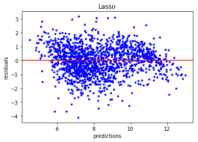
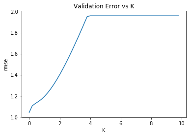
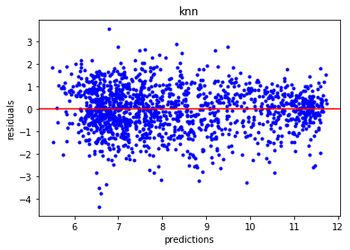
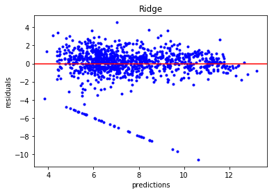
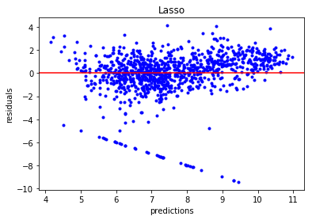
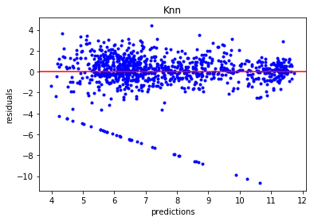
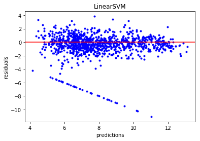

# Voting Prediction

Nesta atividade construiremos modelos preditivos de regressão em scikit learn para a predição dos votos de deputados federais considerando as últimas eleições. As atividades esperadas para essa etapa são descritas a seguir:

1. Baixe os dados aqui (veja descrição dos dados mais abaixo).
2. Considere o pipeline mostrado nesse link (Links para um site externo)Links para um site externo para construir seus modelos de regressão. Isso implica, dentre outras coisas:

    2.1 Analisar as distribuições das variáveis para ver se estão enviesadas e precisam de correção; tratamento de valores ausentes, variáveis categóricas e normalização, quando for o caso.
    
    2.2 Construir modelos de regressão com (ridge e lasso) e sem regularização.
    
    2.3 Considerar também modelos de regressão não paramétrica como K-NN.
    
    2.4 Considerar outros modelos ainda não vistos em sala de sua escolha (e.g. SVR, Regression Trees e Random Florests).
    
    2.5 Tunar os hiperâmetros para cada caso e retornar os rmses de validação cruzada para todos os modelos avaliados.
    
    2.6 Plotar os resíduos versus predições e analisar se esses plots representam bons indícios da adequabilidade dos modelos a esse problema.
    
3. Alguns dias antes da entrega final serão liberados os dados de teste referentes à 2014 para validação final dos seus melhores modelos.

    Dica: Uma coisa que você pode fazer é usar os dados de 2006 como treino e os de 2010 como validação. Uma vez encontrados os melhores modelos para 2010 junte 2006+2010, retreine, e aplique o modelo aos dados de 2014 que serão liberados.
    
4. Responder:

    4.1. Dentre os modelos avaliados, qual foi o que deu o melhor resultado nos dados de 2014 em termos de RMSE? Justifique bem sua resposta.


# Introduction

This assessment was divided into three steps:

1. Data preparation and feature engineering step
2. Model construction
3. Conclusion

First, the dataset was analyzed and prepared to be used in the following step. In the second step, the models were built and applied to the 2014 election dataset. Finally, we summarize the result achieved by the models. 

## 1. Data preparation and feature engineering step


```python
import pandas as pd
import numpy as np
import seaborn as sns
import matplotlib

import matplotlib.pyplot as plt
from sklearn.model_selection import train_test_split
from scipy.stats import skew
from scipy.stats.stats import pearsonr
import warnings
warnings.filterwarnings('ignore')
```

To enable the model use 


```python
data = pd.read_csv("eleicoes_2006_a_2010.csv")
data2014 = pd.read_csv("eleicoes_2014.csv")

data = pd.concat([data,data2014])
data.info()
```

    <class 'pandas.core.frame.DataFrame'>
    Int64Index: 12266 entries, 0 to 4935
    Data columns (total 23 columns):
    ano                                      12266 non-null int64
    sequencial_candidato                     12266 non-null int64
    nome                                     12266 non-null object
    uf                                       12266 non-null object
    partido                                  12266 non-null object
    quantidade_doacoes                       12266 non-null int64
    quantidade_doadores                      12266 non-null int64
    total_receita                            12105 non-null float64
    media_receita                            12105 non-null float64
    recursos_de_outros_candidatos/comites    8131 non-null float64
    recursos_de_pessoas_fisicas              8374 non-null float64
    recursos_de_pessoas_juridicas            5068 non-null float64
    recursos_proprios                        7802 non-null float64
    quantidade_despesas                      12266 non-null int64
    quantidade_fornecedores                  12266 non-null int64
    total_despesa                            12266 non-null float64
    media_despesa                            12266 non-null float64
    cargo                                    12266 non-null object
    sexo                                     12266 non-null object
    grau                                     12266 non-null object
    estado_civil                             12266 non-null object
    ocupacao                                 12266 non-null object
    votos                                    12266 non-null int64
    dtypes: float64(8), int64(7), object(8)
    memory usage: 2.2+ MB
    

First, some features that we think that has no impact to the voters, for instance, name, civil state, and occupation. And since the dataset has only information about 'DEPUTADO FEDERAL' the feature cargo was removed. 


```python
#separar por ano
data = data.drop(['nome','sequencial_candidato','cargo','grau','estado_civil','ocupacao'],axis=1)
```

Before we start to normalize the features, it is important to find correlated features.  Since correlated features, in general, don't improve the machine learning models. 


```python
def plotCorrelation(df,vm=0.7):
    corr = df.corr()

    # Generate a mask for the upper triangle
    mask = np.zeros_like(corr, dtype=np.bool)
    mask[np.triu_indices_from(mask)] = True

    # Set up the matplotlib figure
    f, ax = plt.subplots(figsize=(11, 9))

    # Generate a custom diverging colormap
    cmap = sns.diverging_palette(220, 10, as_cmap=True)
    cmap='viridis'

    # Draw the heatmap with the mask and correct aspect ratio
    sns.heatmap(corr, mask=mask, cmap=cmap, vmax=vm, center=0,
                square=True, linewidths=.5,
                #annot=True, 
                #fmt="g",
                cbar_kws={"shrink": .5}
               )

```


```python
plotCorrelation(data,vm=0.5)
```


As shown in the previous figure, the features ('recursos_de_outros_candidatos/comites' ,'recursos_de_pessoas_fisicas', 'recursos_de_pessoas_juridicas', 'recursos_proprios' and 'quantidade_doadores') are highly correlated with total_receita, and for that reason, we remove these features from our data.


```python
data = data.drop(['recursos_de_outros_candidatos/comites',
           'recursos_de_pessoas_fisicas','recursos_de_pessoas_juridicas',
           'recursos_proprios',
           'quantidade_doadores'],axis=1)
```

In the new correlation heat map (plotted below), we can see that the highly correlated features were removed from the data.


```python
plotCorrelation(data,vm=0.9)
```


As shown in the table below, seven features need to be normalized. 


```python
df = data.dropna()
df.describe().transpose()
```


<div>
<style scoped>
    .dataframe tbody tr th:only-of-type {
        vertical-align: middle;
    }

    .dataframe tbody tr th {
        vertical-align: top;
    }

    .dataframe thead th {
        text-align: right;
    }
</style>
<table border="1" class="dataframe">
  <thead>
    <tr style="text-align: right;">
      <th></th>
      <th>count</th>
      <th>mean</th>
      <th>std</th>
      <th>min</th>
      <th>25%</th>
      <th>50%</th>
      <th>75%</th>
      <th>max</th>
    </tr>
  </thead>
  <tbody>
    <tr>
      <th>ano</th>
      <td>12105.0</td>
      <td>2010.564725</td>
      <td>3.235976</td>
      <td>2006.0</td>
      <td>2006.000000</td>
      <td>2010.000000</td>
      <td>2014.000000</td>
      <td>2014.00</td>
    </tr>
    <tr>
      <th>quantidade_doacoes</th>
      <td>12105.0</td>
      <td>25.622635</td>
      <td>96.412300</td>
      <td>1.0</td>
      <td>4.000000</td>
      <td>9.000000</td>
      <td>22.000000</td>
      <td>6997.00</td>
    </tr>
    <tr>
      <th>total_receita</th>
      <td>12105.0</td>
      <td>173273.085288</td>
      <td>457893.486330</td>
      <td>0.0</td>
      <td>2838.930000</td>
      <td>11800.130000</td>
      <td>89126.200000</td>
      <td>5836139.50</td>
    </tr>
    <tr>
      <th>media_receita</th>
      <td>12105.0</td>
      <td>5750.422579</td>
      <td>14174.233933</td>
      <td>0.0</td>
      <td>614.428571</td>
      <td>1490.308333</td>
      <td>4635.384615</td>
      <td>500180.00</td>
    </tr>
    <tr>
      <th>quantidade_despesas</th>
      <td>12105.0</td>
      <td>136.966378</td>
      <td>426.588469</td>
      <td>1.0</td>
      <td>6.000000</td>
      <td>18.000000</td>
      <td>75.000000</td>
      <td>9932.00</td>
    </tr>
    <tr>
      <th>quantidade_fornecedores</th>
      <td>12105.0</td>
      <td>110.977117</td>
      <td>341.702411</td>
      <td>1.0</td>
      <td>5.000000</td>
      <td>16.000000</td>
      <td>63.000000</td>
      <td>8359.00</td>
    </tr>
    <tr>
      <th>total_despesa</th>
      <td>12105.0</td>
      <td>175151.662170</td>
      <td>466253.955013</td>
      <td>0.0</td>
      <td>2810.000000</td>
      <td>11797.640000</td>
      <td>89601.050000</td>
      <td>7420178.58</td>
    </tr>
    <tr>
      <th>media_despesa</th>
      <td>12105.0</td>
      <td>1434.163495</td>
      <td>5091.225198</td>
      <td>0.0</td>
      <td>422.128571</td>
      <td>815.000000</td>
      <td>1536.691525</td>
      <td>500177.00</td>
    </tr>
    <tr>
      <th>votos</th>
      <td>12105.0</td>
      <td>20092.115985</td>
      <td>46846.575159</td>
      <td>0.0</td>
      <td>674.000000</td>
      <td>2323.000000</td>
      <td>14840.000000</td>
      <td>1524361.00</td>
    </tr>
  </tbody>
</table>
</div>


To increase the accuracy of the model's the elections results will be divided into two groups (South, Southeast states and North, Northeast states).


```python
N = ['AC','AM','AP','PA','RO','RR','TO']
NE = ['AL','BA','CE','MA','MA','PB','PE','PI','RN']
CO = ['GO','MS','MT']
SE = ['ES','MG','RJ','SP']
S = ['PR','RS','SC']

df['regiao'] = np.where(df['uf'].isin(N+NE),'NNE','SSE')
```


```python
df.info()
```

    <class 'pandas.core.frame.DataFrame'>
    Int64Index: 12105 entries, 0 to 4935
    Data columns (total 13 columns):
    ano                        12105 non-null int64
    uf                         12105 non-null object
    partido                    12105 non-null object
    quantidade_doacoes         12105 non-null int64
    total_receita              12105 non-null float64
    media_receita              12105 non-null float64
    quantidade_despesas        12105 non-null int64
    quantidade_fornecedores    12105 non-null int64
    total_despesa              12105 non-null float64
    media_despesa              12105 non-null float64
    sexo                       12105 non-null object
    votos                      12105 non-null int64
    regiao                     12105 non-null object
    dtypes: float64(4), int64(5), object(4)
    memory usage: 1.3+ MB
    

Dummifing the features and normalizing the features


```python
#dummify
ddf = df.drop(['uf'],axis=1)

features = ['quantidade_doacoes','total_receita','media_receita','quantidade_despesas','quantidade_fornecedores',
'total_despesa','media_despesa','votos']

#normalizing skew
for feature in features:
    ddf[feature] = np.log1p(ddf[feature])
    
ddf = pd.get_dummies(ddf)
```

The  2014 voting result, will be used to the final test. The 2006 and 2010 voting result will be employed to the model adjustments. 


```python
df2014 = ddf.loc[ddf['ano'] == 2014]
ddf = ddf.loc[ddf['ano'] != 2014]

ddf = ddf.drop(['ano'],axis=1)
df2014 = df2014.drop(['ano'],axis=1)
```


```python
#dfa
Y = ddf.pop('votos')
X_train, X_validation, Y_train, Y_validation = train_test_split(ddf, Y, test_size=0.2)

Y14 = df2014.pop('votos')
Xt_14, Xv_14, Yt_14, Yv_14 = train_test_split(df2014, Y14, test_size=0.2)
```

## 2. Model construction

To predict the election result, we use the following approaches:

1. Ridge Regression
2. Lasso Regression
3. K-nn
4. Linear SVM Regression


```python
from sklearn.linear_model import Ridge, Lasso , LogisticRegression
from sklearn.model_selection import cross_val_score, train_test_split
from sklearn.metrics import r2_score, mean_squared_error

def rmse_cv(model,Xtrain,Ytrain):
    rmse = np.sqrt(-cross_val_score(model, Xtrain, Ytrain, scoring = "neg_mean_squared_error", cv = 10))
    return(rmse)

def plot_rmse_param(series, param_name):
    series.plot(title = "Validation Error vs " + param_name)
    plt.xlabel(param_name)
    plt.ylabel("rmse")

def best_rmse_param(series):
    best_rmse = series.min()
    best_param = series.idxmin()
    return(best_rmse, best_param)

def plot_data(X,Y):    
    plt.plot(X,Y,'k.')
    plt.xlabel('X')
    plt.ylabel('Y')

def plot_residuals_vs_fit(X,Y, model, title):
    y_pred = model.predict(X)
    res = Y - y_pred
    #res = np.log(Y - y_pred)
    plt.plot(y_pred,res,'k.',color='blue',)
    plt.axhline(y=0., color='r', linestyle='-')
    plt.xlabel("predictions")
    plt.ylabel("residuals")
    plt.title(title)
    #plt.yscale('log')
    
def print_poly_predictions(X,Y, model):
    plot_data(X,Y)
    #x_plot = np.array([i/200.0 for i in range(200)])
    #X_plot = x_plot[:,np.newaxis]
    y_pred = model.predict(X)
    plt.plot(X,y_pred,'g.')
    #plt.axis([0,1,-1.5,2])

def print_coefficients(model):
    w = list(model.coef_)
    w.reverse()
    print (np.poly1d(w) + model.intercept_)
    
def show_results(title,model,best_alpha,X,Y,ret=False):
    y_pred = model.predict(X)
    plot_residuals_vs_fit(X, Y, model,title)
    print("Results")
    if best_alpha != None:
        print("\t Best alpha: %.2f" % best_alpha)
    print("\t Mean squared error: %.2f" % mean_squared_error(Y,y_pred))
    print('\t Variance score: %.2f' % r2_score(Y,y_pred))
    
    if ret:
        return [title,mean_squared_error(Y,y_pred),r2_score(Y,y_pred)]
```

### 2.1 Ridge Regression

Knowing that the RidgeRegession is described by the equation: 

$||y - Xw||^2_2 + alpha * ||w||^2_2$

We can build a no regularized model setting the alpha = 0.


```python
RidgeModel = Ridge(alpha=0)
RidgeModel.fit(X_train, Y_train)
```


    Ridge(alpha=0, copy_X=True, fit_intercept=True, max_iter=None,
       normalize=False, random_state=None, solver='auto', tol=0.001)


```python
print_coefficients(RidgeModel)
```

               46             45             44             43
    1.726e+12 x  + 1.726e+12 x  + 6.124e+12 x  + 6.124e+12 x 
                  42             41             40             39
     + 4.228e+13 x  + 3.733e+12 x  + 3.733e+12 x  + 3.733e+12 x 
                  38             37             36             35
     + 3.733e+12 x  + 3.733e+12 x  + 3.733e+12 x  + 3.733e+12 x 
                  34             33             32             31
     + 3.733e+12 x  + 3.733e+12 x  + 3.733e+12 x  + 3.733e+12 x 
                  30             29             28             27
     - 1.328e+13 x  + 3.733e+12 x  + 3.733e+12 x  + 3.733e+12 x 
                  26             25             24             23
     + 3.733e+12 x  - 6.124e+12 x  + 3.733e+12 x  + 3.733e+12 x 
                  22             21             20             19
     + 3.733e+12 x  + 3.733e+12 x  + 3.919e+13 x  + 3.733e+12 x 
                  18             17             16             15
     + 3.733e+12 x  + 3.733e+12 x  + 3.733e+12 x  + 3.733e+12 x 
                  14             13             12             11
     + 3.733e+12 x  - 2.196e+12 x  + 3.733e+12 x  + 3.733e+12 x 
                  10             9             8             7         6
     + 3.733e+12 x  + 3.733e+12 x + 3.733e+12 x + 3.733e+12 x + 1.556 x
              5         4          3           2
     - 1.495 x + 1.661 x + 0.2006 x + 0.02872 x + 0.3567 x - 1.158e+13
    

The model achieved a low RMSE (**1.07**) and is **73** *percent* explained by R²). As illustrated in the plot below the residue is randomly distributed, and near from zero.


```python
#print_poly_predictions(X_train,Y_train,model)
```


```python
show_results("Ridge",RidgeModel,None,X_validation,Y_validation)
```

    Results
    	 Mean squared error: 1.07
    	 Variance score: 0.73
    


### 2.2 Lasso Regression

Building the lasso regularized ($0 < alphas < 10$) Lasso regression


```python
alphas = np.linspace(0,10,50,endpoint=False)
cv_lasso_rmse = [rmse_cv(Lasso(alpha = alpha), X_train,Y_train).mean() 
            for alpha in alphas ]

series_lasso = pd.Series(cv_lasso_rmse, index = alphas)
plot_rmse_param(series_lasso, "alpha")
```


The best regularized Lasso Regression is shown below.


```python
best_rmse, best_alpha = best_rmse_param(series_lasso)
best_LassoModel = Lasso(alpha = best_alpha)
best_LassoModel.fit(X_train, Y_train)

print_coefficients(best_LassoModel)
```

               46          45             44          43           41
    1.111e-14 x  + 0.2772 x  + 1.137e-14 x  - 0.4739 x  + 0.05204 x 
               40          39          38           37          36
     - 0.4221 x  - 0.3686 x  - 0.1265 x  + 0.06952 x  + 0.2456 x 
               35           34           33          32          31
     + 0.1299 x  - 0.04404 x  - 0.07032 x  - 0.3623 x  + 0.2189 x 
               29            28          27          26          24
     + 0.1005 x  - 0.009801 x  - 0.5542 x  - 0.4039 x  + 0.3891 x 
              23          22            21          19          18
     - 0.152 x  + 0.1326 x  + 0.003684 x  + 0.0931 x  - 0.2254 x 
               17          16          15          14          12
     + 0.2559 x  + 0.2057 x  - 0.2892 x  + 0.5401 x  + 0.2197 x 
              11           10           9          8           7         6
     - 0.371 x  + 0.08315 x  - 0.09373 x + 0.1876 x + 0.09634 x + 1.391 x
              5         4        3           2
     - 1.325 x + 1.453 x + 0.23 x + 0.08445 x + 0.2965 x + 2.538
    

The model achieved (with no regularization, $alpha = 0$) a low RMSE (**1.08**) and is **73** *percent* explained by R²( the same as the Ridge Regression). As illustrated in the plot below the residue is randomly distributed, and near from zero.


```python
show_results("Lasso",best_LassoModel,best_alpha,X_validation,Y_validation)
```

    Results
    	 Best alpha: 0.00
    	 Mean squared error: 1.08
    	 Variance score: 0.73
    





### 2.3 K-nn

Building the KNeighborsRegressor ($2 < k < 30$)


```python
from sklearn.neighbors import KNeighborsRegressor

K = range(2,30)
cv_knn_rmse = [rmse_cv(KNeighborsRegressor(n_neighbors = k), X_train,Y_train).mean() 
            for k in K ]

series_knn = pd.Series(cv_knn_rmse, index = K)
plot_rmse_param(series_lasso, "K")
```





The model achieved (with $k = 29$) a low RMSE (**0.99**) and is **75** *percent* explained by R². As illustrated in the plot below the residue is randomly distributed, and near from zero.


```python
best_rmse, best_k = best_rmse_param(series_knn)
best_knn = KNeighborsRegressor(n_neighbors = best_k)
best_knn.fit(X_train, Y_train)

show_results("knn",best_knn,best_k,X_validation,Y_validation)
```

    Results
    	 Best alpha: 29.00
    	 Mean squared error: 0.99
    	 Variance score: 0.75
    





### 2.4 SVR

As a new regression method, we chose de LinearSVR.


```python
from sklearn.svm import LinearSVR
lsvr = LinearSVR(random_state=0, tol=1e-5)
lsvr.fit(X_validation, Y_validation)

show_results("svm",lsvr,None,X_validation,Y_validation)
```

    Results
    	 Mean squared error: 1.11
    	 Variance score: 0.72
    


The model achieved a low RMSE (**1.11**) and is **72** *percent* explained by R². As illustrated in the plot below the residue is randomly distributed, and near from zero.

## 3. Conclusion

In this section, we plot the result of the original model (trained with the 2006 and 2010 dataset) and in a retrained model (trained with the 2014 dataset). 

### 3.1 Ridge Model

The **original model** failed to predict the election results since the mode achieves a high RMSE and R².


```python
results = []

data = show_results("Ridge",RidgeModel,None,Xv_14, Yv_14,ret=True)
results.append(data)
```

    Results
    	 Mean squared error: 47090662893638453460729856.00
    	 Variance score: -6586791053422158990540800.00
    


The **retrained model** achieved (with the same parameters of the original model) aRMSE of **3.24** and is **53** *percent* explained by R². As illustrated in the plot below the residue is randomly distributed, and near from zero.


```python
results14 = []

RidgeModel14 = Ridge()
RidgeModel14.fit(Xt_14,Yt_14)

data = show_results("Ridge",RidgeModel14,None,Xv_14, Yv_14,ret=True)
results14.append(data)
```

    Results
    	 Mean squared error: 3.29
    	 Variance score: 0.54
    





### 3.2 Lasso Regression

#### 3.2.1 Original


```python
data = show_results("Lasso",best_LassoModel,None,Xv_14, Yv_14,ret=True)
results.append(data)
```

    Results
    	 Mean squared error: 3.88
    	 Variance score: 0.46
    


#### 3.2.2 Retrained Model


```python
Lasso14 = Lasso()
Lasso14.fit(Xt_14,Yt_14)
data = show_results("Lasso",RidgeModel14,None,Xv_14, Yv_14,ret=True)
results14.append(data)
```

    Results
    	 Mean squared error: 3.29
    	 Variance score: 0.54
    





The **original model** and the **retrained model** achieved similar RMSE (**3.88 and 3.29 respectively**) and is **46** and **54** (respectively) *percent* explained by R². As illustrated in the plot below the residue is randomly distributed, and near from zero.

### 3.3 knn

#### 3.3.1 Original Model


```python
data = show_results("Knn",best_knn,None,Xv_14, Yv_14,ret=True)
results.append(data)
```

    Results
    	 Mean squared error: 3.92
    	 Variance score: 0.45
    


#### 3.3.2 Retrained Model


```python
knn14 = KNeighborsRegressor(n_neighbors = best_k)
knn14.fit(Xt_14,Yt_14)
data = show_results("Knn",RidgeModel14,None,Xv_14, Yv_14,ret=True)
results14.append(data)
```

    Results
    	 Mean squared error: 3.29
    	 Variance score: 0.54
    





The **original model** and the **retrained model** achieved similar RMSE (**3.88 and 3.29 respectively**) and is **46** and **54** (respectively) *percent* explained by R². As illustrated in the plot below the residue is randomly distributed, and near from zero.

### 3.4 SVM

#### 3.4.1 Original Model


```python
data = show_results("LinearSVM",lsvr,None,Xv_14, Yv_14,ret=True)
results.append(data)
```

    Results
    	 Mean squared error: 4.44
    	 Variance score: 0.38
    


#### 3.4.2 Retrained model


```python
lsvr14 = LinearSVR(random_state=0, tol=1e-5)
lsvr14.fit(Xt_14,Yt_14)
data = show_results("LinearSVM",RidgeModel14,None,Xv_14, Yv_14,ret=True)
results14.append(data)
```

    Results
    	 Mean squared error: 3.29
    	 Variance score: 0.54
    





The **original model** and the **retrained model** achieved similar RMSE (**4.44 and 3.29 respectively**) and is **38** and **54** (respectively) *percent* explained by R². As illustrated in the plot below the residue is randomly distributed, and near from zero.

### 3.5 Results

In this section we compare the results of the models.


```python
labels = ["algotihm","RMSE","R2"]
rdf = pd.DataFrame.from_records(results,columns=labels)
rdf14 = pd.DataFrame.from_records(results14,columns=labels)
```


```python
sns.factorplot(x='algotihm', y='val', hue='metric', 
               data=rdf14.melt('algotihm', var_name='metric', value_name='val'), kind='bar')
```


    <seaborn.axisgrid.FacetGrid at 0x13e88eafcf8>


```python
z = rdf[rdf['algotihm']!='Ridge']
sns.factorplot(x='algotihm', y='val', hue='metric', 
               data=z.melt('algotihm', var_name='metric', value_name='val'), kind='bar')
```


    <seaborn.axisgrid.FacetGrid at 0x13e8c614da0>


```python
rdf['retrained'] = 'No'
rdf14['retrained'] = 'Yes'
pd.concat([rdf,rdf14]).sort_values(by=['algotihm'])
```


<div>
<style scoped>
    .dataframe tbody tr th:only-of-type {
        vertical-align: middle;
    }

    .dataframe tbody tr th {
        vertical-align: top;
    }

    .dataframe thead th {
        text-align: right;
    }
</style>
<table border="1" class="dataframe">
  <thead>
    <tr style="text-align: right;">
      <th></th>
      <th>algotihm</th>
      <th>RMSE</th>
      <th>R2</th>
      <th>retrained</th>
    </tr>
  </thead>
  <tbody>
    <tr>
      <th>2</th>
      <td>Knn</td>
      <td>3.919336e+00</td>
      <td>4.517841e-01</td>
      <td>No</td>
    </tr>
    <tr>
      <th>2</th>
      <td>Knn</td>
      <td>3.292835e+00</td>
      <td>5.394158e-01</td>
      <td>Yes</td>
    </tr>
    <tr>
      <th>1</th>
      <td>Lasso</td>
      <td>3.875103e+00</td>
      <td>4.579712e-01</td>
      <td>No</td>
    </tr>
    <tr>
      <th>1</th>
      <td>Lasso</td>
      <td>3.292835e+00</td>
      <td>5.394158e-01</td>
      <td>Yes</td>
    </tr>
    <tr>
      <th>3</th>
      <td>LinearSVM</td>
      <td>4.439881e+00</td>
      <td>3.789730e-01</td>
      <td>No</td>
    </tr>
    <tr>
      <th>3</th>
      <td>LinearSVM</td>
      <td>3.292835e+00</td>
      <td>5.394158e-01</td>
      <td>Yes</td>
    </tr>
    <tr>
      <th>4</th>
      <td>LinearSVM</td>
      <td>3.292835e+00</td>
      <td>5.394158e-01</td>
      <td>Yes</td>
    </tr>
    <tr>
      <th>0</th>
      <td>Ridge</td>
      <td>4.709066e+25</td>
      <td>-6.586791e+24</td>
      <td>No</td>
    </tr>
    <tr>
      <th>0</th>
      <td>Ridge</td>
      <td>3.292835e+00</td>
      <td>5.394158e-01</td>
      <td>Yes</td>
    </tr>
  </tbody>
</table>
</div>


As shown in the figures and the table above the **Lasso Regression** achieve the best result considering the RMSE and R². This result can be explained by the fact that the model presented a low error for the expected values.
